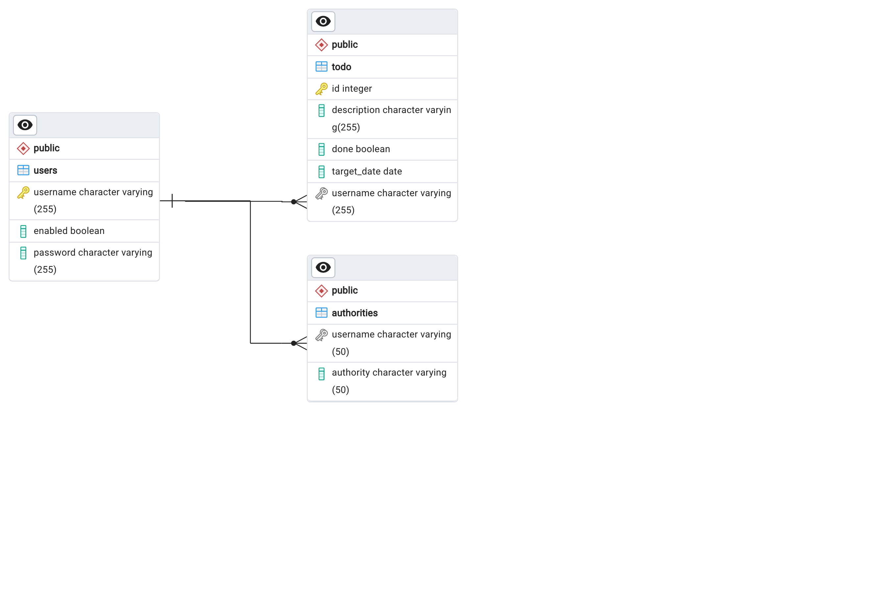
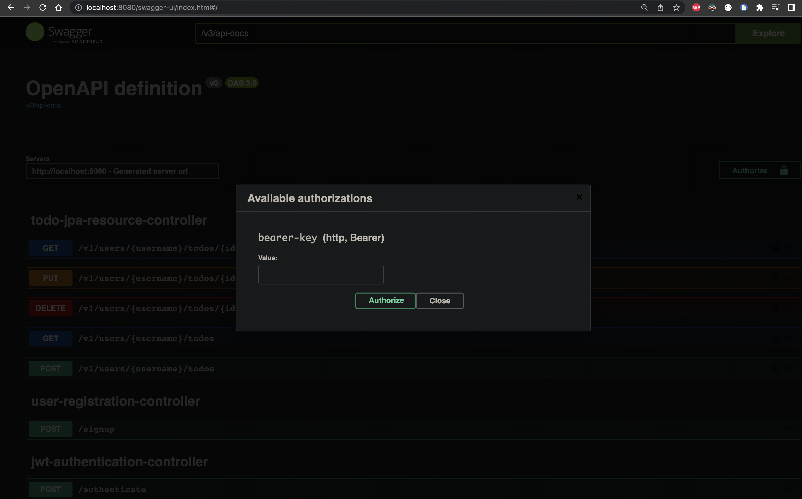
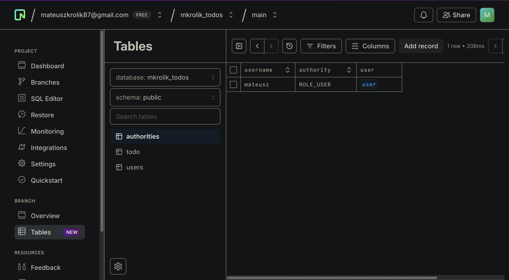
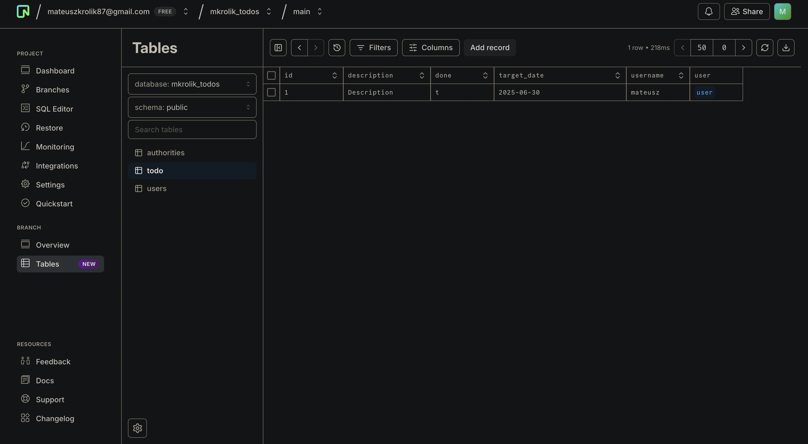
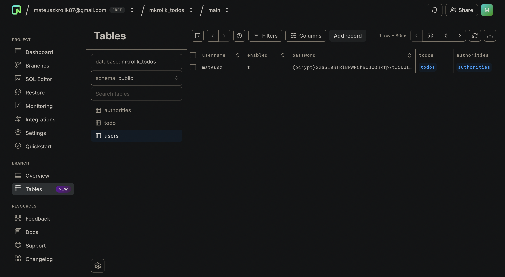
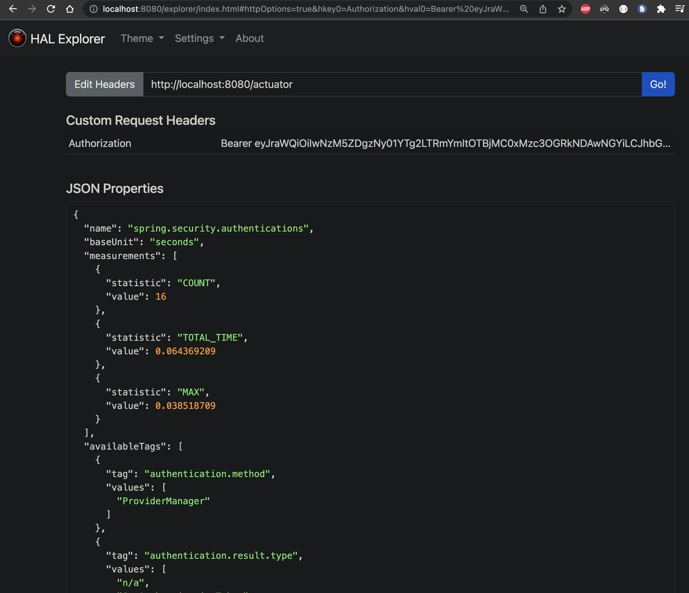
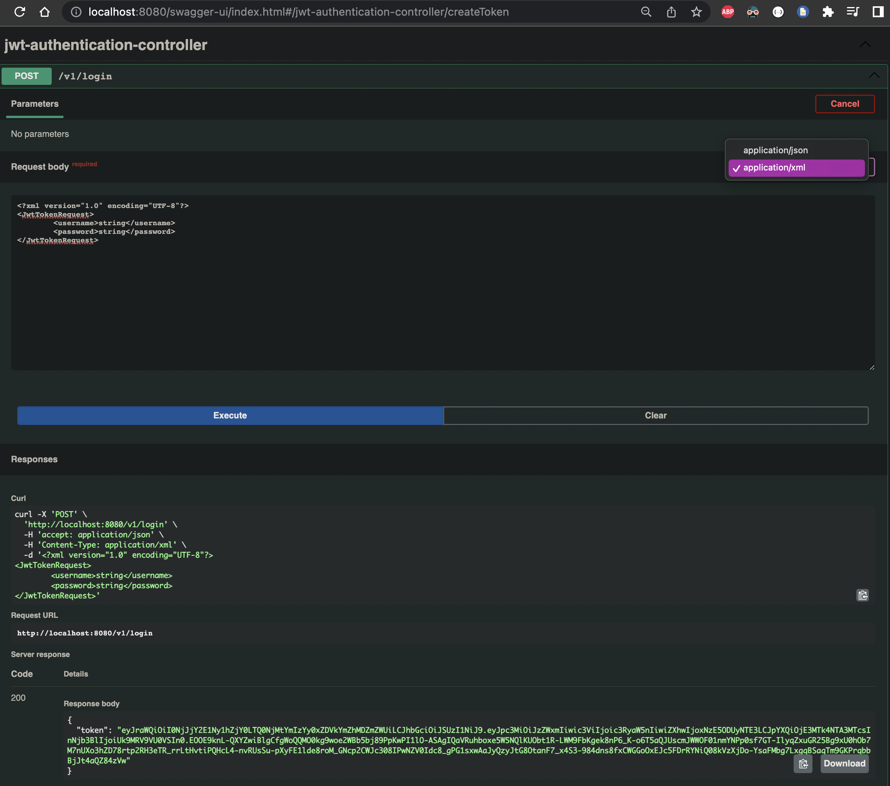

<a name="readme-top"></a>

[![Contributors][contributors-shield]][contributors-url]
[![Forks][forks-shield]][forks-url]
[![Stargazers][stars-shield]][stars-url]
[![Issues][issues-shield]][issues-url]
[![MIT License][license-shield]][license-url]
[![LinkedIn][linkedin-shield]][linkedin-url]

<!-- PROJECT LOGO -->
<br />
<div align="center">
  <a href="https://github.com/MateuszKrolik/Spring_Boot_Todo_BackEnd">
    
  </a>

<h3 align="center">Spring_Boot_Todo_BackEnd</h3>
  <p align="center">
    <br />
    <a href="https://github.com/MateuszKrolik/Spring_Boot_Todo_BackEnd"><strong>Explore the docs »</strong></a>
    <br />
    <br />
    <a href="https://github.com/MateuszKrolik/Spring_Boot_Todo_BackEnd">View Demo</a>
    ·
    <a href="https://github.com/MateuszKrolik/Spring_Boot_Todo_BackEnd/issues">Report Bug</a>
    ·
    <a href="https://github.com/MateuszKrolik/Spring_Boot_Todo_BackEnd/issues">Request Feature</a>
  </p>
</div>

<!-- TABLE OF CONTENTS -->
<details>
  <summary>Table of Contents</summary>
  <ol>
    <li>
      <a href="#about-the-project">About The Project</a>
      <ul>
        <li><a href="#built-with">Built With</a></li>
      </ul>
    </li>
    <li>
      <a href="#getting-started">Getting Started</a>
      <ul>
        <li><a href="#installation">Installation</a></li>
      </ul>
    </li>
    <li><a href="#usage">Usage</a></li>
    <li><a href="#roadmap">Roadmap</a></li>
    <li><a href="#contributing">Contributing</a></li>
    <li><a href="#license">License</a></li>
    <li><a href="#contact">Contact</a></li>
    <li><a href="#acknowledgments">Acknowledgments</a></li>
  </ol>
</details>

<!-- ABOUT THE PROJECT -->

## See the RESTful API in FullStack Action in below videos 😉

https://github.com/MateuszKrolik/Spring_Boot_Todo_BackEnd/assets/127691471/b54256b5-6891-40f3-97c8-280068c115ce

https://github.com/MateuszKrolik/Spring_Boot_Todo_BackEnd/assets/127691471/5a8a5eb3-b4ab-49ce-a0b9-00a096c27077

## EndPoint Sketch Documentation

| Action                         | Method   | URL Pattern                       |
| ------------------------------ | -------- | --------------------------------- |
| Register user with "ROLE_USER" | `POST`   | `/v1/signup`                      |
| Log user in with 30 min JWT    | `POST`   | `/v1/login`                       |
| Retrieve All ToDos             | `GET`    | `/v1/users/{username}/todos`      |
| Retrieve Single Specified ToDo | `GET`    | `/v1/users/{username}/todos/{id}` |
| Delete Specified Single Todo   | `DELETE` | `/v1/users/{username}/todos/{id}` |
| Update Single Specified Todo   | `PUT`    | `/v1/users/{username}/todos/{id}` |
| Create Single Todo             | `POST`   | `/v1/users/{username}/todos`      |

```java
@RestController
@RequestMapping("/v1") // versioning
// ...
// Register user with "ROLE_USER"
    @PostMapping("/signup")
// ...
// Log user in with 30 min JWT
    @PostMapping("/login")
// ...
// Retrieve All ToDos:
    @GetMapping("/users/{username}/todos")
/// ...
// Retrieve Single Specified ToDo:
    @GetMapping("/users/{username}/todos/{id}")
/// ...
// Delete Specified Single Todo
    @DeleteMapping("/users/{username}/todos{id}")
/// ...
// Update Single Specified Todo
    @PutMapping("/users/{username}/todos/{id}")
/// ...
// Create Single Todo
    @PostMapping("/users/{username}/todos")
/// ...
```

## PostgreSQL ERD Diagram Schema (PgAdmin)



## SwaggerUI/OpenAPI + JWT

[](https://mkrolik-spring-todos-backend-lqpyrkgpla-ew.a.run.app/swagger-ui/index.html)

## NEON Serverless PostgreSQL Tables with BCrypt Hashed Passwords





### Angular-based Spring Data REST Hal-Explorer UI with Spring Boot Actuator Monitoring Health Metrics (You need the JWT Authz Bearer Token first 😉)

[](https://mkrolik-spring-todos-backend-lqpyrkgpla-ew.a.run.app/explorer/index.html#uri=/actuator)

## XML Accept-Header Support via Java Jackson Library

### PS. Don't worry, this is a Dummy User and the JWT lasts 30 minutes anyway 😁

[](https://mkrolik-spring-todos-backend-lqpyrkgpla-ew.a.run.app/swagger-ui/index.html)

### Built With

<!-- Primary Technologies -->

- [![MVC][MVC]][MVC-url]
- [![REST API][REST API]][REST API-url]

<!-- Programming Languages -->

- [![Java][Java]][Java-url]

<!-- Web Technologies -->

- [![Spring][Spring]][Spring-url]
- [![Spring Boot][Spring Boot]][Spring Boot-url]
- [![Apache][Apache]][Apache-url]
- [![JWT][JWT]][JWT-url]
- [![Apache Tomcat][Apache Tomcat]][Apache Tomcat-url]
- [![Maven][Maven]][Maven-url]
- [![Spring Security][Spring Security]][Spring Security-url]
- [![Oracle][Oracle]][Oracle-url]

<!-- Database Technologies -->

- [![Spring Data JPA][Spring Data JPA]][Spring Data JPA-url]
- [![JDBC][JDBC]][JDBC-url]
- [![Hibernate][Hibernate]][Hibernate-url]
- [![PostgreSQL][PostgreSQL]][PostgreSQL-url]
- [![Neon][Neon]][Neon-url]
- [![SQL][SQL]][SQL-url]

<!-- Testing and Version Control -->

- [![SwaggerUI/OpenAPI][SwaggerUI/OpenAPI]][SwaggerUI/OpenAPI-url]
- [![Mockito][Mockito]][Mockito-url]
- [![JUnit][JUnit]][JUnit-url]
- [![GitHub Actions][GitHub Actions]][GitHub Actions-url]
- [![Postman][Postman]][Postman-url]

<!-- Containerization -->

- [![Docker][Docker]][Docker-url]
- [![Linux/Unix][Linux/Unix]][Linux/Unix-url]
- [![Bash][Bash]][Bash-url]

<!-- Cloud Technologies -->

- [![GCP Cloud Build][GCP Cloud Build]][GCP Cloud Build-url]
- [![GCP Artifact Registry][GCP Artifact Registry]][GCP Artifact Registry-url]
- [![GCP Cloud Run][GCP Cloud Run]][GCP Cloud Run-url]
- [![Google Cloud Platform][Google Cloud Platform]][Google Cloud Platform-url]
- [![Google Cloud Storage][Google Cloud Storage]][Google Cloud Storage-url]
- [![GCP Secret Manager][GCP Secret Manager]][GCP Secret Manager-url]
- [![GCP IAM][GCP IAM]][GCP IAM-url]

<!-- Data Formats -->

- [![YAML][YAML]][YAML-url]
- [![XML][XML]][XML-url]
- [![JSON][JSON]][JSON-url]
- [![.env][.env]][.env-url]

<!-- IDEs and Editors -->

- [![VSCode][VSCode]][VSCode-url]

<p align="right">(<a href="#readme-top">back to top</a>)</p>

<!-- GETTING STARTED -->

## Getting Started

As a prerequisite i recommend having VScode with Java and Spring Boot Extension Packs, JDK21, Maven and PostgreSQL installed, as well as Docker for Desktop and the GCloud CLI for my GCP Account Role BASH Script.

For a Smooth DataBase management experience also consider using PgAdmin.

### Installation

1. Clone the repo

```sh
git clone https://github.com/MateuszKrolik/Spring_Boot_Todo_BackEnd.git
```

2. Install Build Image w/ Docker-Compose

```sh
docker-compose up --build -d
```

3. Enter your environment variables in `.env` and `GCP Secret Manager`.

```sh
# For the "GCP Secret Manager":
ALLOWED_ORIGIN=YOUR_ALLOWED_ORIGIN
NEON_PASSWORD = YOUR_NEON_PASSWORD;
NEON_USERNAME = YOUR_NEON_USERNAME;
NEON_PORT = YOUR_NEON_PORT;
NEON_HOSTNAME = YOUR_NEON_HOSTNAME;
NEON_DATABASE = YOUR_NEON_DATABASE;

# For the ".ENV File":
APP_FULL_NAME=YOUR_APP_FULL_NAME;
APP_ACRONYM_UPPERCASE=YOUR_APP_ACRONYM_UPPERCASE;
APP_ACRONYM_LOWERCASE=YOUR_APP_ACRONYM_LOWERCASE;
GCLOUD_PROJECT_NUMBER = YOUR_GCLOUD_PROJECT_NUMBER;
GCLOUD_ID = YOUR_GCLOUD_ID;

# for local development using my "postgres.sh" BASH script
# (or a commented out part of my docker-compose.yml file)
# but first you need to run "chmod +x postgres.sh" to make it executable
POSTGRES_PASSWORD = YOUR_POSTGRES_PASSWORD;
```

4. When deploying remember to create a GitHub master branch trigger in GCP Cloud Build, and don't forget to set all the necessary IAM Roles using my BASH script for the Recommended Custom Service Account:

```sh
chmod +x gcloud_custom.sh
```

```bash
#!/bin/bash

source .env

gcloud iam service-accounts create "build-${APP_ACRONYM_LOWERCASE}-dev-sa" \
  --description="Service account for build process in ${APP_FULL_NAME} development environment" \
  --display-name="Build ${APP_ACRONYM_UPPERCASE} Dev SA" \
  --project=$GCLOUD_ID

SA_EMAIL="build-${APP_ACRONYM_LOWERCASE}-dev-sa@${GCLOUD_ID}.iam.gserviceaccount.com"

gcloud projects add-iam-policy-binding $GCLOUD_ID \
  --member="serviceAccount:$SA_EMAIL" \
  --role="roles/artifactregistry.writer"

gcloud projects add-iam-policy-binding $GCLOUD_ID \
  --member="serviceAccount:$SA_EMAIL" \
  --role="roles/run.admin"

gcloud projects add-iam-policy-binding $GCLOUD_ID \
  --member="serviceAccount:$SA_EMAIL" \
  --role="roles/iam.serviceAccountUser"

gcloud projects add-iam-policy-binding $GCLOUD_ID \
  --member="serviceAccount:$SA_EMAIL" \
  --role="roles/secretmanager.secretAccessor"

gcloud projects add-iam-policy-binding $GCLOUD_ID \
  --member="serviceAccount:$SA_EMAIL" \
  --role="roles/cloudbuild.builds.editor"

gcloud projects add-iam-policy-binding $GCLOUD_ID \
  --member="serviceAccount:$SA_EMAIL" \
  --role="roles/logging.admin"

gcloud projects get-iam-policy $GCLOUD_ID \
  --flatten="bindings[].members" \
  --format='table(bindings.role)' \
  --filter="bindings.members:$SA_EMAIL"

# ROLE
# roles/artifactregistry.writer
# roles/cloudbuild.builds.editor
# roles/iam.serviceAccountUser
# roles/logging.admin
# roles/logging.logWriter
# roles/run.admin
# roles/secretmanager.secretAccessor

# To avoid CloudBuild Error - "Permission denied on secret":


gcloud projects add-iam-policy-binding $GCLOUD_ID \
  --member="serviceAccount:$GCLOUD_PROJECT_NUMBER-compute@developer.gserviceaccount.com" \
  --role="roles/secretmanager.secretAccessor"

gcloud projects get-iam-policy $GCLOUD_ID \
  --flatten="bindings[].members" \
  --format='table(bindings.role)' \
  --filter="bindings.members:$GCLOUD_PROJECT_NUMBER-compute@developer.gserviceaccount.com"

# ROLE
# roles/editor
# roles/secretmanager.secretAccessor
```

```sh
chmod +x gcloud_custom.sh
./gcloud_custom.sh
```

<p align="right">(<a href="#readme-top">back to top</a>)</p>

<!-- USAGE EXAMPLES -->

## Usage

_Below you'll find FrontEnd visual usage example of the RESTful API in form of videos 😉_.

To test these out yourself visit this [Link](https://mkrolik-spring-todos-backend-lqpyrkgpla-ew.a.run.app/swagger-ui/index.html) 😉\_

https://github.com/MateuszKrolik/Spring_Boot_Todo_BackEnd/assets/127691471/b54256b5-6891-40f3-97c8-280068c115ce

https://github.com/MateuszKrolik/Spring_Boot_Todo_BackEnd/assets/127691471/5a8a5eb3-b4ab-49ce-a0b9-00a096c27077

<p align="right">(<a href="#readme-top">back to top</a>)</p>

<!-- ROADMAP -->

## Roadmap

- [x] Monolithic Architecture: Model-View-Controller (MVC)
- [x] Containerization via Docker and Docker-Compose
- [x] Constructor-based Dependency Injection and Bean AutoWiring using Spring Framework
- [x] Starter-Projects and Auto-Configuration using Spring Boot Framework
- [x] CORS - Cross-Origin-Resource-Sharing
- [x] DTOs (Data Transfer Objects) using Java Records
- [x] Custom Server-Side Validation using JPA Annotations
- [x] BCrypt User Password Hashing
- [x] Monitoring using Spring Boot Actuator
- [x] Static Filtering using Jackson Framework
- [x] Apache Tomcat Production WebServer
- [x] HikariCP PostgreSQL Connection Pooling
- [x] SwaggerUI Documentation Auto-Generation
- [x] Angular-based HAL Explorer UI
- [x] Custom Exception Handling
- [x] Content Negotiation - Support for XML Accept-Headers using Jackson DataFormat XML
- [x] Custom Spring Security UserDetailsService Implementation
- [x] Proper HTTP Status Codes
- [x] Auto-incrementing Primary Keys (PKs)
- [x] One-to-Many and vice Versa RelationShips using Foreign Key's (FKs)
- [x] Hosted Relational Serverless Auto-Scaling PostgreSQL DataBase via Neon
- [x] Create-Read-Update-Delete (CRUD) Functionality
- [x] Spring Data JPA + Hibernate Framework ORM Mapping
- [x] JDBC for DataBase Connectivity
- [x] Test-Driven-Development(TDD) - WebLayer Unit Testing, Mocking and Stubbing via:
  - [x] JUnit
  - [x] Mockito
- [x] Visualized PostgreSQL Schema (PgAdmin ERD Diagram Feature)
- [x] JWT Authentication & Authorization using Spring Security Framework
- [x] Custom Global Exception Handling
- [x] Environment Variables with FallBack values for Local Development
- [x] SSL/TLS Encryption
- [x] Infrastructure-as-Code (IaC) via CloudBuild YAML file
- [x] Automatized Dockerized CI/CD&IaC Serverless Deployment via:
  - [x] GitHub Master Branch Commit Trigger
  - [x] GCP Cloud Build (IaC & CI/CD)
  - [x] GCP Cloud Run (FaaS/PaaS)
  - [x] GCP Artifact Registry
  - [x] GCP Secret Manager (.ENV)
  - [x] GCP IAM Roles (Least Priveleged Principle)
- [x] Bash Scripts for Automation of IAM Role Setup
- [x] Best Practices

See the [open issues](https://github.com/MateuszKrolik/Spring_Boot_Todo_BackEnd/issues) for a full list of proposed features (and known issues).

<p align="right">(<a href="#readme-top">back to top</a>)</p>

<!-- CONTRIBUTING -->

## Contributing

Contributions are what make the open source community such an amazing place to learn, inspire, and create. Any contributions you make are **greatly appreciated**.

If you have a suggestion that would make this better, please fork the repo and create a pull request. You can also simply open an issue with the tag "enhancement".
Don't forget to give the project a star! Thanks again!

1. Fork the Project
2. Create your Feature Branch (`git checkout -b feature/AmazingFeature`)
3. Commit your Changes (`git commit -m 'Add some AmazingFeature'`)
4. Push to the Branch (`git push origin feature/AmazingFeature`)
5. Open a Pull Request

<p align="right">(<a href="#readme-top">back to top</a>)</p>

<!-- LICENSE -->

## License

Distributed under the MIT License. See `LICENSE` for more information.

<p align="right">(<a href="#readme-top">back to top</a>)</p>

<!-- CONTACT -->

## Contact

Mateusz Królik - [Mateusz Królik](https://www.linkedin.com/in/mateusz-kr%C3%B3lik-8b1862262/) - [mateuszkrolik87@gmail.com](mailto:mateuszkrolik7@gmail.com)

Project Link: [Project Link](https://mkrolik-spring-todos-backend-lqpyrkgpla-ew.a.run.app/swagger-ui/index.html)

GitHub Repository Link: [GitHub Repository Link](https://github.com/MateuszKrolik/Spring_Boot_Todo_BackEnd)

<p align="right">(<a href="#readme-top">back to top</a>)</p>

<!-- ACKNOWLEDGMENTS -->

## Acknowledgments

- [Img Shields](https://shields.io)
- [GitHub Emoji Cheat Sheet](https://www.webpagefx.com/tools/emoji-cheat-sheet)
- [Malven's Flexbox Cheatsheet](https://flexbox.malven.co/)
- [Malven's Grid Cheatsheet](https://grid.malven.co/)
- [SVG Repo](https://www.svgrepo.com/)

<p align="right">(<a href="#readme-top">back to top</a>)</p>

<!-- MARKDOWN LINKS & IMAGES -->
<!-- https://www.markdownguide.org/basic-syntax/#reference-style-links -->

[contributors-shield]: https://img.shields.io/github/contributors/MateuszKrolik/Spring_Boot_Todo_BackEnd.svg?style=for-the-badge
[contributors-url]: https://github.com/MateuszKrolik/Spring_Boot_Todo_BackEnd/graphs/contributors
[forks-shield]: https://img.shields.io/github/forks/MateuszKrolik/Spring_Boot_Todo_BackEnd.svg?style=for-the-badge
[forks-url]: https://github.com/MateuszKrolik/Spring_Boot_Todo_BackEnd/network/members
[stars-shield]: https://img.shields.io/github/stars/MateuszKrolik/Spring_Boot_Todo_BackEnd.svg?style=for-the-badge
[stars-url]: https://github.com/MateuszKrolik/Spring_Boot_Todo_BackEnd/stargazers
[issues-shield]: https://img.shields.io/github/issues/MateuszKrolik/Spring_Boot_Todo_BackEnd.svg?style=for-the-badge
[issues-url]: https://github.com/MateuszKrolik/Spring_Boot_Todo_BackEnd/issues
[license-shield]: https://img.shields.io/github/license/MateuszKrolik/Spring_Boot_Todo_BackEnd.svg?style=for-the-badge
[license-url]: https://github.com/MateuszKrolik/Spring_Boot_Todo_BackEnd/blob/master/LICENSE
[linkedin-shield]: https://img.shields.io/badge/-LinkedIn-black.svg?style=for-the-badge&logo=linkedin&colorB=555
[linkedin-url]: https://linkedin.com/in/mateusz-królik-8b1862262
[product-screenshot]: images/screenshot.gif
[Docker]: https://img.shields.io/badge/Docker-2CA5E0?style=for-the-badge&logo=docker&logoColor=white
[Docker-url]: https://www.docker.com/
[Linux/Unix]: https://img.shields.io/badge/Linux-FCC624?style=for-the-badge&logo=linux&logoColor=black
[Linux/Unix-url]: https://www.linux.org/
[Google Cloud Platform]: https://img.shields.io/badge/Google_Cloud-4285F4?style=for-the-badge&logo=google-cloud&logoColor=white
[Google Cloud Platform-url]: https://cloud.google.com/
[Google Cloud Storage]: https://img.shields.io/badge/Google_Cloud_Storage-4285F4?style=for-the-badge&logo=googlecloudstorage&logoColor=white
[Google Cloud Storage-url]: https://cloud.google.com/storage
[Bash]: https://img.shields.io/badge/Bash-4EAA4B?style=for-the-badge&logo=gnu-bash&logoColor=white
[Bash-url]: https://www.gnu.org/software/bash/
[SQL]: https://img.shields.io/badge/SQL-4479A1?style=for-the-badge&logo=data:image/svg+xml;base64,PHN2ZyB4bWxucz0iaHR0cDovL3d3dy53My5vcmcvMjAwMC9zdmciIHhtbG5zOnhsaW5rPSJodHRwOi8vd3d3LnczLm9yZy8xOTk5L3hsaW5rIiB2aWV3Qm94PSIwIDAgNjEgODEiIGZpbGw9IiNmZmYiIGZpbGwtcnVsZT0iZXZlbm9kZCIgc3Ryb2tlPSIjMDAwIiBzdHJva2UtbGluZWNhcD0icm91bmQiIHN0cm9rZS1saW5lam9pbj0icm91bmQiPjx1c2UgeGxpbms6aHJlZj0iI0EiIHg9Ii41IiB5PSIuNSIvPjxzeW1ib2wgaWQ9IkEiIG92ZXJmbG93PSJ2aXNpYmxlIj48ZyBmaWxsPSIjMDA3MmM2IiBzdHJva2U9Im5vbmUiPjxwYXRoIGQ9Ik0wIDEwLjkyOXY1OC4xNEMwIDc1LjEwNiAxMy40MzIgODAgMzAgODBWMTAuOTI5SDB6Ii8+PHVzZSB4bGluazpocmVmPSIjQyIvPjwvZz48dXNlIHhsaW5rOmhyZWY9IiNDIiBvcGFjaXR5PSIuMTUiIHN0cm9rZT0ibm9uZSIvPjxwYXRoIGQ9Ik02MCAxMC45MjljMCA2LjAzNi0xMy40MzIgMTAuOTI5LTMwIDEwLjkyOVMwIDE2Ljk2NSAwIDEwLjkyOSAxMy40MzIgMCAzMCAwczMwIDQuODkzIDMwIDEwLjkyOSIgc3Ryb2tlPSJub25lIi8+PHBhdGggZD0iTTUzLjg2NiAxMC4yOTljMCAzLjk4NS0xMC42ODUgNy4yMTEtMjMuODY2IDcuMjExUzYuMTMyIDE0LjI4NCA2LjEzMiAxMC4yOTkgMTYuODE5IDMuMDg4IDMwIDMuMDg4czIzLjg2NiAzLjIyOCAyMy44NjYgNy4yMTEiIGZpbGw9IiM3ZmJhMDAiIHN0cm9rZT0ibm9uZSIvPjxwYXRoIGQ9Ik00OC44NjcgMTQuNzA3YzMuMTI0LTEuMjE5IDUuMDAyLTIuNzQ1IDUuMDAyLTQuNDA0QzUzLjg2OCA2LjMxOCA0My4xODMgMy4wOSAzMCAzLjA5UzYuMTM0IDYuMzE4IDYuMTM0IDEwLjMwM2MwIDEuNjU4IDEuODc3IDMuMTg1IDUuMDAyIDQuNDA0IDQuMzYzLTEuNzA0IDExLjE4Mi0yLjgwMyAxOC44NjUtMi44MDNzMTQuNSAxLjA5OSAxOC44NjYgMi44MDMiIGZpbGw9IiNiOGQ0MzIiIHN0cm9rZT0ibm9uZSIvPjxwYXRoIGQ9Ik0yMC40NzIgNTEuMjg3YzAgMS44MDctLjY1MSAzLjIwNi0xLjk1NSA0LjE5N3MtMy4xMDIgMS40ODgtNS4zOTkgMS40ODhjLTEuOTU0IDAtMy41ODctLjM1NC00Ljg5OS0xLjA2M3YtNC4yNTFjMS41MTQgMS4yOTMgMy4xODIgMS45NCA1LjAwNCAxLjk0Ljg4IDAgMS41NjEtLjE3NyAyLjA0MS0uNTMycy43Mi0uODIzLjcyLTEuNDA5YzAtLjU3NS0uMjMxLTEuMDc1LS42OTMtMS41cy0xLjQwMi0uOTc0LTIuODE5LTEuNjQ3Yy0yLjg4OC0xLjM2Mi00LjMzMS0zLjIyNC00LjMzMS01LjU3NyAwLTEuNzA4LjYyOS0zLjA3OCAxLjg4OS00LjExczIuOTMxLTEuNTQ3IDUuMDE2LTEuNTQ3YzEuODQ5IDAgMy4zNzkuMjQ1IDQuNTk2LjczMXYzLjk3MWMtMS4yNzYtLjg4Ni0yLjcyOS0xLjMyOC00LjM1Ny0xLjMyOC0uODE4IDAtMS40NjUuMTc0LTEuOTQuNTIzYTEuNjUgMS42NSAwIDAgMC0uNzEyIDEuNDAxYzAgLjYwMi4xOTEgMS4wOTYuNTc1IDEuNDgxczEuMTY4Ljg2MSAyLjM1NiAxLjQyOGMxLjc3Ljg0MiAzLjAzIDEuNjk1IDMuNzg0IDIuNTYzczEuMTI1IDEuOTUgMS4xMjUgMy4yNDF6bTIwLjM3LTQuMzAyYzAgMi4yNC0uNTA3IDQuMTg1LTEuNTE5IDUuODNzLTIuNDM4IDIuODAxLTQuMjc3IDMuNDY2bDUuNDkxIDUuMTEzaC01LjU0NGwtMy45MjEtNC40MjNjLTEuNjgxLS4wNjEtMy4xOTgtLjUwOS00LjU0OS0xLjM0MXMtMi4zOTUtMS45NzItMy4xMjktMy40Mi0xLjEwMy0zLjA2Mi0xLjEwMy00Ljg0MWMwLTEuOTc0LjM5OC0zLjczNCAxLjE5NC01LjI3OXMxLjkxNi0yLjczNCAzLjM2LTMuNTY2IDMuMDk3LTEuMjQ4IDQuOTY1LTEuMjQ4YzEuNzQxIDAgMy4zMDIuNDAzIDQuNjggMS4yMDlzMi40NDYgMS45NTEgMy4yMDggMy40MzkgMS4xNDQgMy4xNzUgMS4xNDQgNS4wNnptLTQuNDg4LjI0YzAtMS45MzEtLjQxOC0zLjQ1NS0xLjI1NS00LjU3NnMtMS45OC0xLjY4MS0zLjQzMy0xLjY4MWMtMS40NzkgMC0yLjY2Mi41NjItMy41NTIgMS42ODVzLTEuMzMzIDIuNjIxLTEuMzMzIDQuNDg5YzAgMS44Ni40MzUgMy4zNDQgMS4zMDYgNC40NTVzMi4wMjggMS42NjYgMy40NzIgMS42NjZjMS40NzEgMCAyLjYzNi0uNTM4IDMuNDk5LTEuNjEzczEuMjk2LTIuNTUgMS4yOTYtNC40MjZ6bTE4Ljg5MyA5LjQxNEg0My45NzJWMzcuNTk2aDQuMjY0VjUzLjE2aDcuMDF6IiBzdHJva2U9Im5vbmUiLz48L3N5bWJvbD48ZGVmcyA+PHBhdGggaWQ9IkMiIGQ9Ik0yOS41ODkgNzkuOTk5SDMwYzE2LjU2OCAwIDMwLTQuODkyIDMwLTEwLjkyOXYtNTguMTRIMjkuNTg5djY5LjA3eiIvPjwvZGVmcz48L3N2Zz4=
[SQL-url]: https://en.wikipedia.org/wiki/SQL
[GCP Artifact Registry]: https://img.shields.io/badge/GCP_Artifact_Registry-FFFFFF?style=for-the-badge&logo=data:image/svg+xml;base64,PHN2ZyB2ZXJzaW9uPSIxLjEiIGJhc2VQcm9maWxlPSJ0aW55IiBpZD0iTGF5ZXJfMSIgeG1sbnM9Imh0dHA6Ly93d3cudzMub3JnLzIwMDAvc3ZnIiB4bWxuczp4bGluaz0iaHR0cDovL3d3dy53My5vcmcvMTk5OS94bGluayIKCSB4PSIwcHgiIHk9IjBweCIgd2lkdGg9IjI0cHgiIGhlaWdodD0iMjRweCIgdmlld0JveD0iMCAwIDI0IDI0IiBvdmVyZmxvdz0idmlzaWJsZSIgeG1sOnNwYWNlPSJwcmVzZXJ2ZSI+CjxnID4KCTxyZWN0IHk9IjAiIGZpbGw9Im5vbmUiIHdpZHRoPSIyNCIgaGVpZ2h0PSIyNCIvPgoJPHBvbHlnb24gZmlsbC1ydWxlPSJldmVub2RkIiBmaWxsPSIjNUM4NURFIiBwb2ludHM9IjYsMi40IDAuOCw1LjQgMC44LDE5LjEgNiwyMi4xIDYsMTkuNSAzLDE3LjggMyw2LjcgNiw1IAkiLz4KCTxwb2x5Z29uIGZpbGwtcnVsZT0iZXZlbm9kZCIgZmlsbD0iIzMzNjdENiIgcG9pbnRzPSIwLjgsOCAwLjgsMTYuNSAzLDE3LjggMyw2LjcgCSIvPgoJPHBvbHlnb24gZmlsbC1ydWxlPSJldmVub2RkIiBmaWxsPSIjMzM2N0Q2IiBwb2ludHM9IjAuOCw4IDMsNy41IDMsNi43IAkiLz4KCTxwb2x5Z29uIGZpbGwtcnVsZT0iZXZlbm9kZCIgZmlsbD0iIzVDODVERSIgcG9pbnRzPSIxOCwyLjQgMTgsNSAyMSw2LjcgMjEsMTcuOCAxOCwxOS41IDE4LDIyLjEgMjMuMiwxOS4xIDIzLjIsNS40IAkiLz4KCTxwb2x5Z29uIGZpbGwtcnVsZT0iZXZlbm9kZCIgZmlsbD0iIzMzNjdENiIgcG9pbnRzPSIyMSwxNy44IDIzLjIsMTYuNSAyMy4yLDggMjEsNi43IAkiLz4KCTxwb2x5Z29uIGZpbGwtcnVsZT0iZXZlbm9kZCIgZmlsbD0iIzMzNjdENiIgcG9pbnRzPSIyMSw3LjUgMjMuMiw4IDIxLDYuNyAJIi8+Cgk8cG9seWdvbiBmaWxsLXJ1bGU9ImV2ZW5vZGQiIGZpbGw9IiMzMzY3RDYiIHBvaW50cz0iMjEsMTcuMSAyMSwxNy44IDIzLjIsMTYuNSAJIi8+Cgk8ZyB0cmFuc2Zvcm09InRyYW5zbGF0ZSg2Ljg2MDAwMCwgNi41MDAwMDApIj4KCQk8ZyB0cmFuc2Zvcm09InRyYW5zbGF0ZSg0LjU0MDAwMCwgMC4wMDAwMDApIj4KCQkJPHBvbHlnb24gZmlsbC1ydWxlPSJldmVub2RkIiBmaWxsPSIjNUM4NURFIiBwb2ludHM9IjAuNiwtMSAtMi40LDAuNiAwLjYsMi4yIDMuNiwwLjYgCQkJIi8+CgkJCTxwb2x5Z29uIGZpbGwtcnVsZT0iZXZlbm9kZCIgZmlsbD0iIzMzNjdENiIgcG9pbnRzPSIxLDUuOSAzLjksNC4zIDMuOSwxLjIgMSwyLjggCQkJIi8+CgkJCTxwb2x5Z29uIGZpbGwtcnVsZT0iZXZlbm9kZCIgZmlsbD0iIzMzNjdENiIgcG9pbnRzPSIwLjMsMi44IC0yLjcsMS4yIC0yLjcsNC4zIDAuMyw1LjkgCQkJIi8+CgkJPC9nPgoJCTxnIHRyYW5zZm9ybT0idHJhbnNsYXRlKDAuMDAwMDAwLCA3Ljk3NjE5MCkiPgoJCQk8cG9seWdvbiBmaWxsLXJ1bGU9ImV2ZW5vZGQiIGZpbGw9IiM1Qzg1REUiIHBvaW50cz0iMS43LC0zLjEgLTEuMiwtMS41IDEuNywwLjEgNC41LC0xLjUgCQkJIi8+CgkJCTxwb2x5Z29uIGZpbGwtcnVsZT0iZXZlbm9kZCIgZmlsbD0iIzMzNjdENiIgcG9pbnRzPSIxLjksMy44IDQuOCwyLjIgNC44LC0xIDEuOSwwLjYgCQkJIi8+CgkJCTxwb2x5Z29uIGZpbGwtcnVsZT0iZXZlbm9kZCIgZmlsbD0iIzMzNjdENiIgcG9pbnRzPSIxLjQsMC42IC0xLjUsLTEgLTEuNSwyLjIgMS40LDMuOCAJCQkiLz4KCQk8L2c+CgkJPGcgdHJhbnNmb3JtPSJ0cmFuc2xhdGUoOS4zNjAwMDAsIDcuOTc2MTkwKSI+CgkJCTxwb2x5Z29uIGZpbGwtcnVsZT0iZXZlbm9kZCIgZmlsbD0iIzVDODVERSIgcG9pbnRzPSItMC43LC0zLjEgLTMuNiwtMS41IC0wLjcsMC4xIDIuMiwtMS41IAkJCSIvPgoJCQk8cG9seWdvbiBmaWxsLXJ1bGU9ImV2ZW5vZGQiIGZpbGw9IiMzMzY3RDYiIHBvaW50cz0iLTAuNCwzLjggMi41LDIuMiAyLjUsLTEgLTAuNCwwLjYgCQkJIi8+CgkJCTxwb2x5Z29uIGZpbGwtcnVsZT0iZXZlbm9kZCIgZmlsbD0iIzMzNjdENiIgcG9pbnRzPSItMSwwLjYgLTMuOSwtMSAtMy45LDIuMiAtMSwzLjggCQkJIi8+CgkJPC9nPgoJPC9nPgo8L2c+Cjwvc3ZnPgo=
[GCP Artifact Registry-url]: https://cloud.google.com/artifact-registry
[GCP Cloud Run]: https://img.shields.io/badge/GCP_Cloud_Run-808080?style=for-the-badge&logo=data:image/svg+xml;base64,PD94bWwgdmVyc2lvbj0iMS4wIiBlbmNvZGluZz0iVVRGLTgiPz4KPCEtLSBVcGxvYWRlZCB0bzogU1ZHIFJlcG8sIHd3dy5zdmdyZXBvLmNvbSwgR2VuZXJhdG9yOiBTVkcgUmVwbyBNaXhlciBUb29scyAtLT4KPHN2ZyB3aWR0aD0iODAwcHgiIGhlaWdodD0iODAwcHgiIHZpZXdCb3g9IjAgLTEyLjUgMjU2IDI1NiIgdmVyc2lvbj0iMS4xIiB4bWxucz0iaHR0cDovL3d3dy53My5vcmcvMjAwMC9zdmciIHhtbG5zOnhsaW5rPSJodHRwOi8vd3d3LnczLm9yZy8xOTk5L3hsaW5rIiBwcmVzZXJ2ZUFzcGVjdFJhdGlvPSJ4TWlkWU1pZCI+CgkJPGc+CgkJCQk8cGF0aCBkPSJNNzUuMzkwMTQ3LDAgQzY3LjE5NjQzNjUsMC4xNDQyNDk0NDMgNTkuNjkyNjE0Nyw0LjYxOTQwMzEyIDU1LjY3MDczNSwxMS43NTk0NjU1IEw1NS42NzA3MzUsMTEuNzU5NDY1NSBMMy4wNTI3NTcyNCwxMDIuOTk1ODEzIEMtMS4wMTc1ODU3NSwxMTAuMDc5NDMgLTEuMDE3NTg1NzUsMTE4Ljc5MTk4MiAzLjA1Mjc1NzI0LDEyNS44NzUwMjkgTDMuMDUyNzU3MjQsMTI1Ljg3NTAyOSBMNTUuNjUwNzc5NSwyMTcuODcxOTY0IEM1OS42MzE2MDgsMjI1LjExMTIzNCA2Ny4xMTQ5MDQyLDIyOS43MzM0ODggNzUuMzY5NjIxNCwyMzAuMDUyMjA1IEw3NS4zNjk2MjE0LDIzMC4wNTIyMDUgTDE4MC41ODYxOTIsMjMwLjA1MjIwNSBDMTg4Ljg0MDkwOSwyMjkuNzY4MjY3IDE5Ni4zMzc4ODksMjI1LjE2NDgyOSAyMDAuMzI1NTU5LDIxNy45MzI0MDEgTDIwMC4zMjU1NTksMjE3LjkzMjQwMSBMMjUyLjkyMzU4MSwxMjYuNDU1NDQ4IEMyNTQuOTczMjkyLDEyMi44NTcxOTQgMjU1Ljk5Nzg2MiwxMTguODUxMjc4IDI1NS45OTc4NjIsMTE0Ljg0NTkzMyBMMjU1Ljk5Nzg2MiwxMTQuODQ1OTMzIEMyNTUuOTk3ODYyLDExMC44NDA1ODggMjU0Ljk3MzI5MiwxMDYuODM0NjczIDI1Mi45MjM1ODEsMTAzLjIzNTg0OSBMMjUyLjkyMzU4MSwxMDMuMjM1ODQ5IEwyMDAuMzI1NTU5LDExLjc1OTQ2NTUgQzE5Ni4zMDA4MjksNC42MjIyNTM5IDE4OC43OTkyODcsMC4xNDgyNDA1MzUgMTgwLjYwNjE0NywwIEwxODAuNjA2MTQ3LDAgTDc1LjM5MDE0NywwIFoiIGZpbGw9IiM0Mjg1RjQiPgoNPC9wYXRoPgoJCQkJPHBhdGggZD0iTTIzNi40OTUxNzgsMTU1LjAyNzI0OSBMMjAwLjMyNTU1OSwyMTcuOTMyNDAxIEMxOTYuMzM3ODg5LDIyNS4xNjQ4MjkgMTg4Ljg0MDkwOSwyMjkuNzY4MjY3IDE4MC41ODYxOTIsMjMwLjA1MjIwNSBMMTQwLjUxMDE1OCwyMzAuMDUyMjA1IEw4Mi4wMzgxMDc4LDE3MS4wNTcxNDcgTDk5LjI3NTYzMTIsMTE1LjQ3Mzc4OSBMODIuMDM4MTA3OCw1OS4yNTQxMzYzIEw5OS43NDMxNTksNzEuMTQ3MDE4MyBMMTIzLjU0ODg3OCw5NS4xNjU5NzU5IEwxMTIuNDI5MTI4LDU5LjI1NDEzNjMgTDE5NS44MDQxNjYsMTE1LjI2MTY5MSBMMjM2LjQ5NTE3OCwxNTUuMDI3MjQ5IFoiIGZpbGwtb3BhY2l0eT0iMC4wNyIgZmlsbD0iIzAwMDAwMCIgZmlsbC1ydWxlPSJub256ZXJvIj4KDTwvcGF0aD4KCQkJCTxwYXRoIGQ9Ik04Mi4wMzgyNzg4LDU5LjI1MzkwODIgTDk5Ljc0MzMzMDEsNzEuMTQ3MzYwNCBMMTEzLjYyMjA2NSwxMTUuNzY1NDgxIEw5OS45OTAyMDc2LDE1OS4wNDMxNjQgTDgyLjAzODI3ODgsMTcxLjA1NzQ5IEw5OS4zODA3MTA5LDExNS4yNjE0NjMgTDgyLjAzODI3ODgsNTkuMjUzOTA4MiBaIE0xMjcuMzg1NDU3LDc5LjA4OTkxNzEgTDEzNS45Nzc3MDcsMTA2Ljg4MTU5NiBMMTY4Ljk2NjkyNywxMDYuODgxNTk2IEwxMjcuMzg1NDU3LDc5LjA4OTkxNzEgWiBNMTk1LjgwNDE2NiwxMTUuMjYxNzQ4IEwxMTIuNDI5MTI4LDE3MS4wNTcyMDQgTDEyOS43NzE1NiwxMTUuMjYxNzQ4IEwxMTIuNDI5MTI4LDU5LjI1MzYyMzIgTDE5NS44MDQxNjYsMTE1LjI2MTc0OCBaIiBmaWxsPSIjRkZGRkZGIj4KDTwvcGF0aD4KCQk8L2c+Cjwvc3ZnPg==
[GCP Cloud Run-url]: https://cloud.google.com/run
[JUnit]: https://img.shields.io/badge/JUnit-25A162?style=for-the-badge&logo=junit5&logoColor=white
[JUnit-url]: https://junit.org/
[YAML]: https://img.shields.io/badge/YAML-000000?style=for-the-badge&logo=yaml&logoColor=white
[YAML-url]: https://yaml.org/
[.env]: https://img.shields.io/badge/.env-5A9?style=for-the-badge&logo=dotenv&logoColor=white
[.env-url]: https://github.com/motdotla/dotenv
[GitHub Actions]: https://img.shields.io/badge/GitHub_Actions-2088FF?style=for-the-badge&logo=githubactions&logoColor=white
[GitHub Actions-url]: https://github.com/features/actions
[XML]: https://img.shields.io/badge/XML-1572B6?style=for-the-badge&logo=data:image/svg+xml;base64,PD94bWwgdmVyc2lvbj0iMS4wIiBlbmNvZGluZz0idXRmLTgiPz4KDTwhLS0gVXBsb2FkZWQgdG86IFNWRyBSZXBvLCB3d3cuc3ZncmVwby5jb20sIEdlbmVyYXRvcjogU1ZHIFJlcG8gTWl4ZXIgVG9vbHMgLS0+Cjxzdmcgd2lkdGg9IjgwMHB4IiBoZWlnaHQ9IjgwMHB4IiB2aWV3Qm94PSItNCAwIDY0IDY0IiB4bWxucz0iaHR0cDovL3d3dy53My5vcmcvMjAwMC9zdmciPgoNPHBhdGggZD0iTTUuMTEyLS4wMjRjLTIuODAzIDAtNS4wNzQgMi4yNzItNS4wNzQgNS4wNzR2NTMuODQxYzAgMi44MDMgMi4yNzEgNS4wNzQgNS4wNzQgNS4wNzRoNDUuNzc0YzIuODAxIDAgNS4wNzQtMi4yNzEgNS4wNzQtNS4wNzR2LTM4LjYwNmwtMTguOTAyLTIwLjMwOWgtMzEuOTQ2eiIgZmlsbC1ydWxlPSJldmVub2RkIiBjbGlwLXJ1bGU9ImV2ZW5vZGQiIGZpbGw9IiNGQzdCMjQiLz4KDTxnIGZpbGwtcnVsZT0iZXZlbm9kZCIgY2xpcC1ydWxlPSJldmVub2RkIj4KDTxwYXRoIGQ9Ik01NS45NzcgMjAuMzUydjFoLTEyLjc5OXMtNi4zMTItMS4yNi02LjEyOS02LjcwN2MwIDAgLjIwOCA1LjcwNyA2LjAwNCA1LjcwN2gxMi45MjR6IiBmaWxsPSIjRkI1QzFCIi8+Cg08cGF0aCBkPSJNMzcuMDc0IDB2MTQuNTYxYzAgMS42NTYgMS4xMDQgNS43OTEgNi4xMDQgNS43OTFoMTIuNzk5bC0xOC45MDMtMjAuMzUyeiIgb3BhY2l0eT0iLjUiIGZpbGw9IiNmZmZmZmYiLz4KDTwvZz4KDTxwYXRoIGQ9Ik0xOS4zNzEgNTMuODQ4Yy0uMjE3IDAtLjQxNC0uMDg5LS41NDEtLjI3bC0zLjcyNy00Ljk3LTMuNzQ1IDQuOTdjLS4xMjYuMTgxLS4zMjMuMjctLjU0LjI3LS4zOTYgMC0uNzIxLS4zMDYtLjcyMS0uNzIgMC0uMTQ0LjAzNy0uMzA2LjE0NS0uNDMybDMuODg5LTUuMTMxLTMuNjE5LTQuODI2Yy0uMDktLjEyNi0uMTQ0LS4yNy0uMTQ0LS40MTQgMC0uMzQzLjI4OC0uNzIxLjcyLS43MjEuMjE3IDAgLjQzMy4xMDguNTc2LjI4OGwzLjQzOSA0LjYyNyAzLjQzOS00LjY0NmMuMTI1LS4xOC4zMjQtLjI3LjU0LS4yNy4zNzggMCAuNzM3LjMwNi43MzcuNzIxIDAgLjE0NC0uMDM1LjI4OC0uMTI1LjQxNGwtMy42MTkgNC44MDggMy44ODkgNS4xNDljLjA5LjEyNi4xMjcuMjcuMTI3LjQxNS4wMDEuMzk2LS4zMjMuNzM4LS43Mi43Mzh6bTE0LjQ1NS0uMDE4Yy0uNDE0IDAtLjczOC0uMzI0LS43MzgtLjczOHYtOS4yNTRsLTQuMDMzIDkuNzU5Yy0uMDU1LjE0My0uMi4yMzMtLjM3OS4yMzMtLjE0NCAwLS4yODctLjA5LS4zNDItLjIzNGwtNC4wMTYtOS43NTl2OS4yNTRjMCAuNDE0LS4zMjQuNzM4LS43NTYuNzM4LS40MTQgMC0uNzM4LS4zMjQtLjczOC0uNzM4di0xMC4yNjJjMC0uNjQ4LjU1OS0xLjIwNyAxLjI0Mi0xLjIwNy40ODYgMCAuOTkuMjg4IDEuMTg4Ljc1NmwzLjQzOCA4LjM3MyAzLjQ1Ny04LjM3M2MuMTk5LS40NjguNjg2LS43NTYgMS4xODktLjc1Ni42ODQgMCAxLjI0Mi41NTggMS4yNDIgMS4yMDd2MTAuMjYzYy4wMDIuNDE0LS4zMjIuNzM4LS43NTQuNzM4em0xMC41NDYtLjEwOGgtNS40NTZjLS41OTQgMC0xLjA4LS40ODYtMS4wOC0xLjA4MXYtMTAuMzE2YzAtLjM5Ni4zMjQtLjcyMS43NzQtLjcyMS4zOTYgMCAuNzIuMzI0LjcyLjcyMXYxMC4wNjVoNS4wNDJjLjM2IDAgLjY0Ny4yODguNjQ3LjY0OC4wMDEuMzk2LS4yODcuNjg0LS42NDcuNjg0eiIgZmlsbD0iI2ZmZmZmZiIvPgoNPC9zdmc+
[XML-url]: https://www.w3.org/XML/
[JSON]: https://img.shields.io/badge/JSON-000000?style=for-the-badge&logo=json&logoColor=white
[JSON-url]: https://www.json.org/json-en.html
[MVC]: https://img.shields.io/badge/Model_View_Controller_(MVC)-blue?style=for-the-badge
[MVC-url]: https://en.wikipedia.org/wiki/Model%E2%80%93view%E2%80%93controller
[GCP Cloud Build]: https://img.shields.io/badge/GCP_Cloud_Build-4285F4?style=for-the-badge&logo=data:image/svg+xml;base64,PHN2ZyB4bWxucz0iaHR0cDovL3d3dy53My5vcmcvMjAwMC9zdmciIHhtbG5zOnhsaW5rPSJodHRwOi8vd3d3LnczLm9yZy8xOTk5L3hsaW5rIiB2aWV3Qm94PSIwIDAgNzIgODEiIGZpbGw9IiNmZmYiIGZpbGwtcnVsZT0iZXZlbm9kZCIgc3Ryb2tlPSIjMDAwIiBzdHJva2UtbGluZWNhcD0icm91bmQiIHN0cm9rZS1saW5lam9pbj0icm91bmQiPjx1c2UgeGxpbms6aHJlZj0iI0EiIHg9Ii41IiB5PSIuNSIvPjxzeW1ib2wgaWQ9IkEiIG92ZXJmbG93PSJ2aXNpYmxlIj48ZyBzdHJva2U9Im5vbmUiIGZpbGwtcnVsZT0ibm9uemVybyI+PHBhdGggZD0iTTM1LjMyOSA1Ny4zOTlsMTQuMzYtOC4yODFWMzIuNTU1bC00LjgxNC0yLjgxNS0xNC4zNiAyNC44ODUgNC44MTQgMi43NzR6IiBmaWxsPSIjNDI4NWY0Ii8+PHBhdGggZD0iTTIwLjk2OSAzMi41NTV2MTYuNTYzbDQuODE0IDIuNzc0IDE0LjQwMS0yNC44NDQtNC44NTUtMi44MTUtMTQuMzYgOC4zMjJ6IiBmaWxsPSIjNjY5ZGY2Ii8+PHBhdGggZD0iTTMyLjUxNCA2Mi4zMzVsLTE3LjIxNi05Ljk1NFYzMi41NTVMMCAyMy43MDJ2MzcuNTMyTDMyLjUxNCA4MFY2Mi4zMzV6TTE4LjExMyAyNy42NTlsMTcuMjE2LTkuOTU0IDE3LjIxNiA5Ljk1NCAxNS4zMzktOC44NTNMMzUuMzI5IDAgMi43NzQgMTguODA3bDE1LjMzOSA4Ljg1M3pNNTUuMzYgNTIuMzgxbC0xNy4yMTYgOS45NTRWODBsMzIuNTU1LTE4Ljc2NlYyMy43MDJMNTUuMzYgMzIuNTU1djE5LjgyN3oiIGZpbGw9IiNhZWNiZmEiLz48L2c+PC9zeW1ib2w+PC9zdmc+
[GCP Cloud Build-url]: https://cloud.google.com/cloud-build
[GCP Secret Manager]: https://img.shields.io/badge/GCP_Secret_Manager-FFFFFF?style=for-the-badge&logo=data:image/svg+xml;base64,PD94bWwgdmVyc2lvbj0iMS4wIiBlbmNvZGluZz0idXRmLTgiPz4KDTwhLS0gVXBsb2FkZWQgdG86IFNWRyBSZXBvLCB3d3cuc3ZncmVwby5jb20sIEdlbmVyYXRvcjogU1ZHIFJlcG8gTWl4ZXIgVG9vbHMgLS0+Cjxzdmcgd2lkdGg9IjgwMHB4IiBoZWlnaHQ9IjgwMHB4IiB2aWV3Qm94PSIwIDAgMjQgMjQiIHZlcnNpb249IjEuMSIgeG1sbnM9Imh0dHA6Ly93d3cudzMub3JnLzIwMDAvc3ZnIiB4bWxuczp4bGluaz0iaHR0cDovL3d3dy53My5vcmcvMTk5OS94bGluayI+CiAgICA8ZyBzdHJva2U9Im5vbmUiIHN0cm9rZS13aWR0aD0iMSIgZmlsbD0ibm9uZSIgZmlsbC1ydWxlPSJldmVub2RkIj4KICAgICAgICA8ZyB0cmFuc2Zvcm09InRyYW5zbGF0ZSgyLjAwMDAwMCwgNi4wMDAwMDApIiBmaWxsPSIjNDI4NUY0IiBmaWxsLXJ1bGU9Im5vbnplcm8iPgogICAgICAgICAgICA8cGF0aCBkPSJNMjAsOS40MTQ2OTEyNWUtMTQgTDIwLDExLjg4Njc5MjUgTDE2LjAzNzczNTgsMTEuODg2NzkyNSBDMTUuOTMzNTMxMiwxMS44ODY3OTI1IDE1Ljg0OTA1NjYsMTEuODAyMzE3OSAxNS44NDkwNTY2LDExLjY5ODExMzIgTDE1Ljg0OTA1NjYsMTAuNTY2MDM3NyBDMTUuODQ5MDU2NiwxMC40NjE4MzMxIDE1LjkzMzUzMTIsMTAuMzc3MzU4NSAxNi4wMzc3MzU4LDEwLjM3NzM1ODUgTDE4LjQ5MDA1NjYsMTAuMzc3IEwxOC40OTAwNTY2LDEuNTA5IEwxNi4wMzc3MzU4LDEuNTA5NDMzOTYgQzE1LjkzMzUzMTIsMS41MDk0MzM5NiAxNS44NDkwNTY2LDEuNDI0OTU5MzkgMTUuODQ5MDU2NiwxLjMyMDc1NDcyIEwxNS44NDkwNTY2LDAuMTg4Njc5MjQ1IEMxNS44NDkwNTY2LDAuMDg0NDc0NTc1NSAxNS45MzM1MzEyLDkuNDExMDU0MzRlLTE0IDE2LjAzNzczNTgsOS40MTQ2OTEyNWUtMTQgTDIwLDkuNDE0NjkxMjVlLTE0IFogTTQuMzA5MTAxLDkuNDE0NjkxMjVlLTE0IEM0LjQxMzMwNTY3LDkuMzg3Nzg2OWUtMTQgNC40OTc3ODAyNCwwLjA4NDQ3NDU3NTUgNC40OTc3ODAyNCwwLjE4ODY3OTI0NSBMNC40OTc3ODAyNCwxLjMyMDc1NDcyIEM0LjQ5Nzc4MDI0LDEuNDI0OTU5MzkgNC40MTMzMDU2NywxLjUwOTQzMzk2IDQuMzA5MTAxLDEuNTA5NDMzOTYgTDEuNTA5LDEuNTA5IEwxLjUwOSwxMC4zNzcgTDQuMjkyNDUyODMsMTAuMzc3MzU4NSBDNC4zOTY2NTc1LDEwLjM3NzM1ODUgNC40ODExMzIwOCwxMC40NjE4MzMxIDQuNDgxMTMyMDgsMTAuNTY2MDM3NyBMNC40ODExMzIwOCwxMS42OTgxMTMyIEM0LjQ4MTEzMjA4LDExLjgwMjMxNzkgNC4zOTY2NTc1LDExLjg4Njc5MjUgNC4yOTI0NTI4MywxMS44ODY3OTI1IEwyLjE0MDUwOTk5ZS0xMywxMS44ODY3OTI1IEwyLjE0MDUwOTk5ZS0xMyw5LjQxNDY5MTI1ZS0xNCBMNC4zMDkxMDEsOS40MTQ2OTEyNWUtMTQgWiBNMTUuNDI3MTA5OCwzLjg2NzkyNDUzIEwxNS40MjcxMDk4LDUuMzI0MDU2NiBMMTUuNDg3OTMwNSw1LjM0ODUyOTQxIEwxNi44MzgxNDk0LDQuODcxMzA5NjYgTDE3LjExNzkyNDUsNS42OTExNDg3MiBMMTUuNzU1NTQxNCw2LjE1NjEzMjA4IEwxNS43MTkwNDksNi4yNTQwMjMzMSBMMTYuNjU1Njg3NCw3LjUxNDM3MjkyIEwxNS45NTAxNjc2LDguMDI4MzAxODkgTDE1LjAzNzg1NzUsNi43Njc5NTIyOCBMMTQuOTUyNzA4NSw2Ljc2Nzk1MjI4IEwxNC4wNDAzOTg0LDguMDI4MzAxODkgTDEzLjMzNDg3ODYsNy41MTQzNzI5MiBMMTQuMjU5MzUyOSw2LjI1NDAyMzMxIEwxNC4yMzUwMjQ2LDYuMTU2MTMyMDggTDEyLjg3MjY0MTUsNS42OTExNDg3MiBMMTMuMTUyNDE2Niw0Ljg3MTMwOTY2IEwxNC40OTA0NzE0LDUuMzQ4NTI5NDEgTDE0LjU2MzQ1NjIsNS4zMjQwNTY2IEwxNC41NjM0NTYyLDMuODY3OTI0NTMgTDE1LjQyNzEwOTgsMy44Njc5MjQ1MyBaIE01LjE5NTk3NzczLDMuODY3OTI0NTMgTDUuMTk1OTc3NzMsNS4zMDk2Mzk0NSBMNS4yNTY3OTg0LDUuMzMzODY5OTYgTDYuNjA3MDE3MzUsNC44NjEzNzUxNSBMNi44ODY3OTI0NSw1LjY3MzA5NyBMNS41MjQ0MDkzNiw2LjEzMzQ3NjU2IEw1LjQ4NzkxNjk2LDYuMjMwMzk4NTcgTDYuNDI0NTU1MzMsNy40NzgyNjk0NyBMNS43MTkwMzU1Miw3Ljk4NzExMDAzIEw0LjgwNjcyNTQxLDYuNzM5MjM5MTMgTDQuNzIxNTc2NDcsNi43MzkyMzkxMyBMMy44MDkyNjYzNyw3Ljk4NzExMDAzIEwzLjEwMzc0NjU1LDcuNDc4MjY5NDcgTDQuMDI4MjIwNzksNi4yMzAzOTg1NyBMNC4wMDM4OTI1Miw2LjEzMzQ3NjU2IEwyLjY0MTUwOTQzLDUuNjczMDk3IEwyLjkyMTI4NDUzLDQuODYxMzc1MTUgTDQuMjU5MzM5MzUsNS4zMzM4Njk5NiBMNC4zMzIzMjQxNiw1LjMwOTYzOTQ1IEw0LjMzMjMyNDE2LDMuODY3OTI0NTMgTDUuMTk1OTc3NzMsMy44Njc5MjQ1MyBaIE0xMC4yOTAzMTczLDMuODY3OTI0NTMgTDEwLjI5MDMxNzMsNS4zMDk2Mzk0NSBMMTAuMzUxMTM4LDUuMzMzODY5OTYgTDExLjcwMTM1Nyw0Ljg2MTM3NTE1IEwxMS45ODExMzIxLDUuNjczMDk3IEwxMC42MTg3NDksNi4xMzM0NzY1NiBMMTAuNTgyMjU2Niw2LjIzMDM5ODU3IEwxMS41MTg4OTUsNy40NzgyNjk0NyBMMTAuODEzMzc1MSw3Ljk4NzExMDAzIEw5LjkwMTA2NTA0LDYuNzM5MjM5MTMgTDkuODE1OTE2MDksNi43MzkyMzkxMyBMOC45MDM2MDU5OSw3Ljk4NzExMDAzIEw4LjE5ODA4NjE4LDcuNDc4MjY5NDcgTDkuMTIyNTYwNDIsNi4yMzAzOTg1NyBMOS4wOTgyMzIxNSw2LjEzMzQ3NjU2IEw3LjczNTg0OTA2LDUuNjczMDk3IEw4LjAxNTYyNDE2LDQuODYxMzc1MTUgTDkuMzUzNjc4OTcsNS4zMzM4Njk5NiBMOS40MjY2NjM3OCw1LjMwOTYzOTQ1IEw5LjQyNjY2Mzc4LDMuODY3OTI0NTMgTDEwLjI5MDMxNzMsMy44Njc5MjQ1MyBaIiA+Cg08L3BhdGg+CiAgICAgICAgPC9nPgogICAgPC9nPgo8L3N2Zz4=
[GCP Secret Manager-url]: https://cloud.google.com/secret-manager
[VSCode]: https://img.shields.io/badge/VSCode-007ACC?style=for-the-badge&logo=visualstudiocode&logoColor=white
[VSCode-url]: https://code.visualstudio.com/
[GCP IAM]: https://img.shields.io/badge/GCP_IAM-000000?style=for-the-badge&logo=data:image/svg+xml;base64,PHN2ZyB4bWxucz0iaHR0cDovL3d3dy53My5vcmcvMjAwMC9zdmciIHdpZHRoPSIyNHB4IiBoZWlnaHQ9IjI0cHgiIHZpZXdCb3g9IjAgMCAyNCAyNCI+PGRlZnM+PHN0eWxlPi5jbHMtMXtmaWxsOiM2NjlkZjY7fS5jbHMtMSwuY2xzLTJ7ZmlsbC1ydWxlOmV2ZW5vZGQ7fS5jbHMtMntmaWxsOiM0Mjg1ZjQ7fTwvc3R5bGU+PC9kZWZzPjx0aXRsZT5JY29uXzI0cHhfSUFNX0NvbG9yPC90aXRsZT48ZyBkYXRhLW5hbWU9IlByb2R1Y3QgSWNvbnMiPjxnID48cGF0aCBjbGFzcz0iY2xzLTEiIGQ9Ik0xMiwyLDMuNzksNS40MnY1LjYzYzAsNS4wNiwzLjUsOS44LDguMjEsMTEsNC43MS0xLjE1LDguMjEtNS44OSw4LjIxLTEwLjk1VjUuNDJabTAsMy43OWEyLjYzLDIuNjMsMCwxLDEtMS44Ni43N0EyLjYzLDIuNjMsMCwwLDEsMTIsNS43OVptNC4xMSwxMS4xNUE4LjY0LDguNjQsMCwwLDEsMTIsMTkuODdhOC42NCw4LjY0LDAsMCwxLTQuMTEtMi45M1YxNC42OWMwLTEuNjcsMi43NC0yLjUyLDQuMTEtMi41MnM0LjExLjg1LDQuMTEsMi41MnYyLjI1WiIvPjxwYXRoIGNsYXNzPSJjbHMtMiIgZD0iTTEyLDJWNS43OWEyLjYzLDIuNjMsMCwxLDEsMCw1LjI2djEuMTJjMS4zNywwLDQuMTEuODUsNC4xMSwyLjUydjIuMjVBOC42NCw4LjY0LDAsMCwxLDEyLDE5Ljg3VjIyYzQuNzEtMS4xNSw4LjIxLTUuODksOC4yMS0xMC45NVY1LjQyWiIvPjwvZz48L2c+PC9zdmc+
[GCP IAM-url]: https://cloud.google.com/iam
[SwaggerUI/OpenAPI]: https://img.shields.io/badge/-SwaggerUI/OpenAPI-%2385EA2D?style=for-the-badge&logo=swagger&logoColor=white
[SwaggerUI/OpenAPI-url]: https://swagger.io/
[Postman]: https://img.shields.io/badge/Postman-FF6C37?style=for-the-badge&logo=postman&logoColor=white
[Postman-url]: https://www.postman.com/
[Java-url]: https://www.oracle.com/java/
[Java]: https://img.shields.io/badge/Java-ED8B00?style=for-the-badge&logo=openjdk&logoColor=white
[Spring-url]: https://spring.io/
[Spring]: https://img.shields.io/badge/Spring-6DB33F?style=for-the-badge&logo=spring&logoColor=white
[Spring Boot-url]: https://spring.io/projects/spring-boot
[Spring Boot]: https://img.shields.io/badge/Spring_Boot-6DB33F?style=for-the-badge&logo=springboot&logoColor=white
[JWT-url]: https://jwt.io/
[JWT]: https://img.shields.io/badge/JWT-000000?style=for-the-badge&logo=JSON%20web%20tokens&logoColor=white
[Apache-url]: https://httpd.apache.org/
[Apache]: https://img.shields.io/badge/Apache-D22128?style=for-the-badge&logo=apache&logoColor=white
[Apache Tomcat-url]: https://tomcat.apache.org/
[Apache Tomcat]: https://img.shields.io/badge/Apache_Tomcat-F8DC75?style=for-the-badge&logo=apachetomcat&logoColor=black
[Maven-url]: https://maven.apache.org/
[Maven]: https://img.shields.io/badge/Maven-C71A36?style=for-the-badge&logo=apachemaven&logoColor=white
[Spring Security-url]: https://spring.io/projects/spring-security
[Spring Security]: https://img.shields.io/badge/Spring_Security-6DB33F?style=for-the-badge&logo=springsecurity&logoColor=white
[Oracle-url]: https://www.oracle.com/
[Oracle]: https://img.shields.io/badge/Oracle-F80000?style=for-the-badge&logo=oracle&logoColor=white
[Hibernate-url]: https://hibernate.org/
[Hibernate]: https://img.shields.io/badge/Hibernate-59666C?style=for-the-badge&logo=hibernate&logoColor=white
[PostgreSQL-url]: https://www.postgresql.org/
[PostgreSQL]: https://img.shields.io/badge/PostgreSQL-316192?style=for-the-badge&logo=postgresql&logoColor=white
[Neon-url]: https://neon.tech/
[Neon]: https://img.shields.io/badge/Neon-black?style=for-the-badge&logo=data:image/svg+xml;base64,PHN2ZyB3aWR0aD0iMjIiIGhlaWdodD0iMjQiIHZpZXdCb3g9IjAgMCAyMiAyNCIgZmlsbD0ibm9uZSIgeG1sbnM9Imh0dHA6Ly93d3cudzMub3JnLzIwMDAvc3ZnIj4KPGcgaWQ9IkxvZ28gc2lnbiI+CjxnIGlkPSJSZWN0YW5nbGUgMzc1MCAoU3Ryb2tlKSI+CjxwYXRoIGZpbGwtcnVsZT0iZXZlbm9kZCIgY2xpcC1ydWxlPSJldmVub2RkIiBkPSJNMCA0LjY0ODM4QzAgMi41MTE0MSAxLjY1MjcgMC43NzkwNTMgMy42OTE0IDAuNzc5MDUzSDE3LjcxODdDMTkuNzU3NCAwLjc3OTA1MyAyMS40MTAxIDIuNTExNDEgMjEuNDEwMSA0LjY0ODM4VjE3LjE1MzZDMjEuNDEwMSAxOS4zNjQ0IDE4Ljc0MTEgMjAuMzIzOSAxNy40NDY3IDE4LjU3ODVMMTMuMzk5OCAxMy4xMjE3VjE5LjczODdDMTMuMzk5OCAyMS42NjIgMTEuOTEyNCAyMy4yMjExIDEwLjA3NzUgMjMuMjIxMUgzLjY5MTRDMS42NTI3IDIzLjIyMTEgMCAyMS40ODg4IDAgMTkuMzUxOFY0LjY0ODM4Wk0zLjY5MTQgMy44NzQ1MUMzLjI4MzY2IDMuODc0NTEgMi45NTMxMiA0LjIyMDk4IDIuOTUzMTIgNC42NDgzOFYxOS4zNTE4QzIuOTUzMTIgMTkuNzc5MiAzLjI4MzY2IDIwLjEyNTcgMy42OTE0IDIwLjEyNTdIMTAuMTg4M0MxMC4zOTIxIDIwLjEyNTcgMTAuNDQ2NyAxOS45NTI0IDEwLjQ0NjcgMTkuNzM4N1YxMC44NjUzQzEwLjQ0NjcgOC42NTQ1MiAxMy4xMTU3IDcuNjk1MDEgMTQuNDEwMSA5LjQ0MDQ3TDE4LjQ1NyAxNC44OTcyVjQuNjQ4MzhDMTguNDU3IDQuMjIwOTggMTguNDk1NiAzLjg3NDUxIDE4LjA4NzkgMy44NzQ1MUgzLjY5MTRaIiBmaWxsPSIjMDBFMEQ5Ii8+CjxwYXRoIGZpbGwtcnVsZT0iZXZlbm9kZCIgY2xpcC1ydWxlPSJldmVub2RkIiBkPSJNMCA0LjY0ODM4QzAgMi41MTE0MSAxLjY1MjcgMC43NzkwNTMgMy42OTE0IDAuNzc5MDUzSDE3LjcxODdDMTkuNzU3NCAwLjc3OTA1MyAyMS40MTAxIDIuNTExNDEgMjEuNDEwMSA0LjY0ODM4VjE3LjE1MzZDMjEuNDEwMSAxOS4zNjQ0IDE4Ljc0MTEgMjAuMzIzOSAxNy40NDY3IDE4LjU3ODVMMTMuMzk5OCAxMy4xMjE3VjE5LjczODdDMTMuMzk5OCAyMS42NjIgMTEuOTEyNCAyMy4yMjExIDEwLjA3NzUgMjMuMjIxMUgzLjY5MTRDMS42NTI3IDIzLjIyMTEgMCAyMS40ODg4IDAgMTkuMzUxOFY0LjY0ODM4Wk0zLjY5MTQgMy44NzQ1MUMzLjI4MzY2IDMuODc0NTEgMi45NTMxMiA0LjIyMDk4IDIuOTUzMTIgNC42NDgzOFYxOS4zNTE4QzIuOTUzMTIgMTkuNzc5MiAzLjI4MzY2IDIwLjEyNTcgMy42OTE0IDIwLjEyNTdIMTAuMTg4M0MxMC4zOTIxIDIwLjEyNTcgMTAuNDQ2NyAxOS45NTI0IDEwLjQ0NjcgMTkuNzM4N1YxMC44NjUzQzEwLjQ0NjcgOC42NTQ1MiAxMy4xMTU3IDcuNjk1MDEgMTQuNDEwMSA5LjQ0MDQ3TDE4LjQ1NyAxNC44OTcyVjQuNjQ4MzhDMTguNDU3IDQuMjIwOTggMTguNDk1NiAzLjg3NDUxIDE4LjA4NzkgMy44NzQ1MUgzLjY5MTRaIiBmaWxsPSJ1cmwoI3BhaW50MF9saW5lYXJfNTQzXzIwMikiLz4KPHBhdGggZmlsbC1ydWxlPSJldmVub2RkIiBjbGlwLXJ1bGU9ImV2ZW5vZGQiIGQ9Ik0wIDQuNjQ4MzhDMCAyLjUxMTQxIDEuNjUyNyAwLjc3OTA1MyAzLjY5MTQgMC43NzkwNTNIMTcuNzE4N0MxOS43NTc0IDAuNzc5MDUzIDIxLjQxMDEgMi41MTE0MSAyMS40MTAxIDQuNjQ4MzhWMTcuMTUzNkMyMS40MTAxIDE5LjM2NDQgMTguNzQxMSAyMC4zMjM5IDE3LjQ0NjcgMTguNTc4NUwxMy4zOTk4IDEzLjEyMTdWMTkuNzM4N0MxMy4zOTk4IDIxLjY2MiAxMS45MTI0IDIzLjIyMTEgMTAuMDc3NSAyMy4yMjExSDMuNjkxNEMxLjY1MjcgMjMuMjIxMSAwIDIxLjQ4ODggMCAxOS4zNTE4VjQuNjQ4MzhaTTMuNjkxNCAzLjg3NDUxQzMuMjgzNjYgMy44NzQ1MSAyLjk1MzEyIDQuMjIwOTggMi45NTMxMiA0LjY0ODM4VjE5LjM1MThDMi45NTMxMiAxOS43NzkyIDMuMjgzNjYgMjAuMTI1NyAzLjY5MTQgMjAuMTI1N0gxMC4xODgzQzEwLjM5MjEgMjAuMTI1NyAxMC40NDY3IDE5Ljk1MjQgMTAuNDQ2NyAxOS43Mzg3VjEwLjg2NTNDMTAuNDQ2NyA4LjY1NDUyIDEzLjExNTcgNy42OTUwMSAxNC40MTAxIDkuNDQwNDdMMTguNDU3IDE0Ljg5NzJWNC42NDgzOEMxOC40NTcgNC4yMjA5OCAxOC40OTU2IDMuODc0NTEgMTguMDg3OSAzLjg3NDUxSDMuNjkxNFoiIGZpbGw9InVybCgjcGFpbnQxX2xpbmVhcl81NDNfMjAyKSIgZmlsbC1vcGFjaXR5PSIwLjQiLz4KPC9nPgo8cGF0aCBpZD0iUmVjdGFuZ2xlIDM3NTAgKFN0cm9rZSlfMiIgZD0iTTE3LjcxOTMgMC43NzkwNTNDMTkuNzU4IDAuNzc5MDUzIDIxLjQxMDcgMi41MTE0MSAyMS40MTA3IDQuNjQ4MzhWMTcuMTUzNkMyMS40MTA3IDE5LjM2NDQgMTguNzQxNyAyMC4zMjM5IDE3LjQ0NzIgMTguNTc4NUwxMy40MDA0IDEzLjEyMTdWMTkuNzM4N0MxMy40MDA0IDIxLjY2MiAxMS45MTMgMjMuMjIxMSAxMC4wNzgxIDIzLjIyMTFDMTAuMjgyIDIzLjIyMTEgMTAuNDQ3MyAyMy4wNDc5IDEwLjQ0NzMgMjIuODM0MlYxMC44NjUzQzEwLjQ0NzMgOC42NTQ1MiAxMy4xMTYzIDcuNjk1MDEgMTQuNDEwNyA5LjQ0MDQ3TDE4LjQ1NzYgMTQuODk3MlYxLjU1MjkyQzE4LjQ1NzYgMS4xMjU1MiAxOC4xMjcxIDAuNzc5MDUzIDE3LjcxOTMgMC43NzkwNTNaIiBmaWxsPSIjNjNGNjU1Ii8+CjwvZz4KPGRlZnM+CjxsaW5lYXJHcmFkaWVudCBpZD0icGFpbnQwX2xpbmVhcl81NDNfMjAyIiB4MT0iMjEuNDEwMSIgeTE9IjIzLjIyMTEiIHgyPSIxLjU3OTEyIiB5Mj0iMS43MDUyNCIgZ3JhZGllbnRVbml0cz0idXNlclNwYWNlT25Vc2UiPgo8c3RvcCBzdG9wLWNvbG9yPSIjNjJGNzU1Ii8+CjxzdG9wIG9mZnNldD0iMSIgc3RvcC1jb2xvcj0iIzhGRjk4NiIgc3RvcC1vcGFjaXR5PSIwIi8+CjwvbGluZWFyR3JhZGllbnQ+CjxsaW5lYXJHcmFkaWVudCBpZD0icGFpbnQxX2xpbmVhcl81NDNfMjAyIiB4MT0iMjEuNDEwMSIgeTE9IjIzLjIyMTEiIHgyPSI4LjU0MTMiIHkyPSIxOC40NDU3IiBncmFkaWVudFVuaXRzPSJ1c2VyU3BhY2VPblVzZSI+CjxzdG9wIHN0b3Atb3BhY2l0eT0iMC45Ii8+CjxzdG9wIG9mZnNldD0iMSIgc3RvcC1jb2xvcj0iIzFBMUExQSIgc3RvcC1vcGFjaXR5PSIwIi8+CjwvbGluZWFyR3JhZGllbnQ+CjwvZGVmcz4KPC9zdmc+Cg==
[REST API-url]: https://example.com/
[REST API]: https://img.shields.io/badge/REST_API-white?style=for-the-badge&logo=data:image/svg+xml;base64,PD94bWwgdmVyc2lvbj0iMS4wIiBlbmNvZGluZz0idXRmLTgiPz48c3ZnIHZlcnNpb249IjEuMSIgaWQ9IkxheWVyXzEiIHhtbG5zPSJodHRwOi8vd3d3LnczLm9yZy8yMDAwL3N2ZyIgeG1sbnM6eGxpbms9Imh0dHA6Ly93d3cudzMub3JnLzE5OTkveGxpbmsiIHg9IjBweCIgeT0iMHB4IiB2aWV3Qm94PSIwIDAgMTIyLjg4IDEwMC4zMyIgc3R5bGU9ImVuYWJsZS1iYWNrZ3JvdW5kOm5ldyAwIDAgMTIyLjg4IDEwMC4zMyIgeG1sOnNwYWNlPSJwcmVzZXJ2ZSI+PHN0eWxlIHR5cGU9InRleHQvY3NzIj48IVtDREFUQVsNCgkuc3Qwe2ZpbGwtcnVsZTpldmVub2RkO2NsaXAtcnVsZTpldmVub2RkO30NCl1dPjwvc3R5bGU+PGc+PHBhdGggY2xhc3M9InN0MCIgZD0iTTEwMi43OSw3LjExbDIuNTksMy40MWMwLjY4LDAuOSwwLjUxLDIuMTktMC4zOSwyLjg3bC0yLjc1LDIuMDljMC41LDEuMzMsMC44MiwyLjc1LDAuOTUsNC4ybDMuMTMsMC40MyBjMS4xMiwwLjE1LDEuOSwxLjE5LDEuNzUsMi4zMWwtMC41OCw0LjI1Yy0wLjE1LDEuMTItMS4xOSwxLjkxLTIuMzEsMS43NWwtMy40Mi0wLjQ3Yy0wLjYxLDEuMzMtMS4zOSwyLjU1LTIuMzEsMy42NGwxLjkyLDIuNTIgYzAuNjgsMC45LDAuNSwyLjE5LTAuNCwyLjg3bC0zLjQxLDIuNTljLTAuOSwwLjY4LTIuMTksMC41LTIuODctMC4zOWwtMi4wOS0yLjc1Yy0xLjM0LDAuNS0yLjc1LDAuODItNC4yMSwwLjk1bC0wLjQzLDMuMTMgYy0wLjE1LDEuMTItMS4xOSwxLjktMi4zMSwxLjc1bC00LjI1LTAuNThjLTEuMTItMC4xNS0xLjktMS4xOS0xLjc1LTIuMzFsMC40Ny0zLjQyYy0xLjMyLTAuNjEtMi41NS0xLjM5LTMuNjQtMi4zbC0yLjUyLDEuOTEgYy0wLjksMC42OC0yLjE5LDAuNTEtMi44Ny0wLjM5bC0yLjU5LTMuNDFjLTAuNjgtMC45LTAuNTEtMi4xOSwwLjM5LTIuODdsMi43NS0yLjA5Yy0wLjUtMS4zNC0wLjgyLTIuNzUtMC45NS00LjJsLTMuMTMtMC40MyBjLTEuMTItMC4xNS0xLjkxLTEuMTktMS43NS0yLjMxbDAuNTgtNC4yNWMwLjE2LTEuMTIsMS4xOS0xLjksMi4zMS0xLjc1bDMuNDIsMC40N2MwLjYxLTEuMzIsMS4zOS0yLjU1LDIuMy0zLjY0bC0xLjkxLTIuNTIgQzcxLjgzLDcuMjgsNzIsNS45OSw3Mi45LDUuMzFsMy40MS0yLjU5YzAuOS0wLjY4LDIuMTktMC41MSwyLjg3LDAuMzlsMi4wOSwyLjc1YzEuMzMtMC41LDIuNzUtMC44Miw0LjItMC45NWwwLjQzLTMuMTMgYzAuMTUtMS4xMiwxLjE5LTEuOTEsMi4zMS0xLjc2bDQuMjUsMC41OGMxLjEyLDAuMTUsMS45MSwxLjE5LDEuNzUsMi4zMWwtMC40NywzLjQyYzEuMzMsMC42MSwyLjU1LDEuMzksMy42NSwyLjMxbDIuNTItMS45MSBDMTAwLjgxLDYuMDQsMTAyLjEsNi4yMSwxMDIuNzksNy4xMUwxMDIuNzksNy4xMUwxMDIuNzksNy4xMXogTTI5LjY3LDY3LjEydi0xNi41aDguNWMxLjU4LDAsMi43OCwwLjEzLDMuNjEsMC40MSBjMC44MywwLjI3LDEuNTEsMC43NywyLjAxLDEuNWMwLjUxLDAuNzQsMC43NywxLjYzLDAuNzcsMi42OGMwLDAuOTEtMC4yLDEuNzEtMC41OSwyLjM3Yy0wLjM5LDAuNjctMC45MywxLjIxLTEuNjEsMS42MiBjLTAuNDMsMC4yNi0xLjAzLDAuNDgtMS43OSwwLjY1YzAuNjEsMC4yMSwxLjA1LDAuNCwxLjMyLDAuNjFjMC4xOSwwLjE0LDAuNDYsMC40MywwLjgxLDAuODdjMC4zNSwwLjQ0LDAuNTksMC43OSwwLjcxLDEuMDMgbDIuNDgsNC43N2gtNS43NmwtMi43Mi01LjAzYy0wLjM1LTAuNjUtMC42NS0xLjA4LTAuOTItMS4yN2MtMC4zNy0wLjI1LTAuNzktMC4zOC0xLjI1LTAuMzhoLTAuNDV2Ni42OEgyOS42N0wyOS42Nyw2Ny4xMnogTTQ3LjY1LDk1Ljg1aC05LjUybC0xLjM3LDQuNDhoLTguNThsMTAuMjMtMjcuMTloOS4ybDEwLjE5LDI3LjE5aC04LjhMNDcuNjUsOTUuODVMNDcuNjUsOTUuODV6IE00NS44Nyw4OS45NmwtMi45Ny05Ljc4IGwtMi45OCw5Ljc4SDQ1Ljg3TDQ1Ljg3LDg5Ljk2eiBNNTkuNzgsNzMuMTRoMTMuOThjMy4wNSwwLDUuMzMsMC43Miw2Ljg0LDIuMTdjMS41MSwxLjQ1LDIuMjcsMy41MiwyLjI3LDYuMTkgYzAsMi43NS0wLjgzLDQuOS0yLjQ4LDYuNDVjLTEuNjUsMS41NS00LjE4LDIuMzItNy41NywyLjMyaC00LjYxdjEwLjA2aC04LjQzVjczLjE0TDU5Ljc4LDczLjE0eiBNNjguMjEsODQuNzZoMi4wNyBjMS42MywwLDIuNzgtMC4yOCwzLjQ0LTAuODVjMC42Ni0wLjU2LDAuOTktMS4yOSwwLjk5LTIuMTZjMC0wLjg1LTAuMjktMS41OC0wLjg2LTIuMTdjLTAuNTctMC41OS0xLjY1LTAuODktMy4yMy0wLjg5aC0yLjQxIFY4NC43Nkw2OC4yMSw4NC43NnogTTg2LjI3LDczLjE0aDguNDN2MjcuMTloLTguNDNWNzMuMTRMODYuMjcsNzMuMTR6IE0zNC43OSw1Ny4zMmgyLjE1YzAuMjMsMCwwLjY4LTAuMDgsMS4zNS0wLjIzIGMwLjM0LTAuMDcsMC42Mi0wLjI0LDAuODMtMC41MmMwLjIyLTAuMjgsMC4zMi0wLjYsMC4zMi0wLjk2YzAtMC41My0wLjE3LTAuOTUtMC41MS0xLjIzYy0wLjM0LTAuMjktMC45Ny0wLjQzLTEuOS0wLjQzaC0yLjI0IFY1Ny4zMkwzNC43OSw1Ny4zMnogTTQ2Ljg3LDUwLjYyaDEzLjY1djMuNTJoLTguNTN2Mi42M2g3LjkxdjMuMzZoLTcuOTF2My4yNWg4Ljc4djMuNzNoLTEzLjlWNTAuNjJMNDYuODcsNTAuNjJ6IE02MS45OCw2MS42NiBsNC44NC0wLjNjMC4xLDAuNzksMC4zMiwxLjM4LDAuNjQsMS43OWMwLjUzLDAuNjYsMS4yOCwxLDIuMjUsMWMwLjcyLDAsMS4yOS0wLjE3LDEuNjgtMC41MWMwLjM5LTAuMzQsMC41OS0wLjc0LDAuNTktMS4xOSBjMC0wLjQzLTAuMTktMC44MS0wLjU2LTEuMTVjLTAuMzctMC4zNC0xLjI0LTAuNjUtMi42MS0wLjk2Yy0yLjIzLTAuNS0zLjgyLTEuMTctNC43OC0yYy0wLjk2LTAuODMtMS40NC0xLjg5LTEuNDQtMy4xOCBjMC0wLjg1LDAuMjUtMS42NSwwLjc0LTIuNGMwLjQ5LTAuNzUsMS4yMy0xLjM1LDIuMjItMS43OGMwLjk5LTAuNDMsMi4zNC0wLjY0LDQuMDYtMC42NGMyLjExLDAsMy43MSwwLjM5LDQuODIsMS4xOCBjMS4xLDAuNzksMS43NiwyLjAzLDEuOTcsMy43NWwtNC43OSwwLjI5Yy0wLjEzLTAuNzUtMC40LTEuMy0wLjgtMS42M2MtMC40MS0wLjM0LTAuOTgtMC41MS0xLjY5LTAuNTEgYy0wLjU5LDAtMS4wNCwwLjEzLTEuMzQsMC4zOGMtMC4zLDAuMjUtMC40NSwwLjU2LTAuNDUsMC45MmMwLDAuMjYsMC4xMywwLjQ5LDAuMzcsMC43MWMwLjI0LDAuMjEsMC44LDAuNDIsMS43LDAuNjEgYzIuMjMsMC40OCwzLjgzLDAuOTcsNC43OSwxLjQ2YzAuOTYsMC40OSwxLjY3LDEuMSwyLjEsMS44M2MwLjQ0LDAuNzIsMC42NiwxLjU0LDAuNjYsMi40NGMwLDEuMDYtMC4yOSwyLjAzLTAuODgsMi45MiBjLTAuNTgsMC44OS0xLjQsMS41Ny0yLjQ1LDIuMDNjLTEuMDUsMC40Ni0yLjM3LDAuNjktMy45NywwLjY5Yy0yLjgsMC00Ljc1LTAuNTQtNS44My0xLjYyQzYyLjc0LDY0LjY5LDYyLjEzLDYzLjMyLDYxLjk4LDYxLjY2IEw2MS45OCw2MS42NnogTTc3LjY5LDUwLjYyaDE1LjUxdjQuMDhIODh2MTIuNDJIODIuOVY1NC43aC01LjIxVjUwLjYyTDc3LjY5LDUwLjYyeiBNNjAuNTMsMTEuNDZjLTEuODMtMC4xNC0zLjY4LTAuMTItNS41MSwwLjA2IGMtNS42MywwLjU0LTExLjEsMi41OS0xNS42Miw2LjFjLTUuMjMsNC4wNS05LjIsMTAuMTEtMTAuNzMsMTguMTRsLTAuNDgsMi41MWwtMi41LDAuNDRjLTIuNDUsMC40My00LjY0LDEuMDItNi41NiwxLjc3IGMtMS44NiwwLjcyLTMuNTIsMS42MS00Ljk3LDIuNjZjLTEuMTYsMC44NC0yLjE2LDEuNzgtMy4wMSwyLjhjLTIuNjMsMy4xNS0zLjg1LDcuMS0zLjgyLDExLjFjMC4wMyw0LjA2LDEuMzUsOC4xNiwzLjc5LDExLjUzIGMwLjkxLDEuMjUsMS45NiwyLjQsMy4xNiwzLjRjMS4yMiwxLjAxLDIuNTksMS44NSw0LjEzLDIuNDhjMC44NywwLjM2LDEuOCwwLjY2LDIuNzcsMC45djcuNDljLTItMC4zNi0zLjg0LTAuOS01LjU2LTEuNjEgYy0yLjI3LTAuOTQtNC4yOC0yLjE1LTYuMDUtMy42M2MtMS42OC0xLjQtMy4xNS0yLjk5LTQuNC00LjcyQzEuODQsNjguMjgsMC4wNCw2Mi42NiwwLDU3LjA2Yy0wLjA0LTUuNjYsMS43Mi0xMS4yOSw1LjUyLTE1Ljg1IGMxLjIzLTEuNDgsMi42OC0yLjg0LDQuMzQtNC4wNGMxLjkzLTEuNCw0LjE0LTIuNTgsNi42NC0zLjU1YzEuNzItMC42NywzLjU2LTEuMjMsNS41LTEuNjhjMi4yLTguNzQsNi44OS0xNS40NywxMi45Mi0yMC4xNCBjNS42NC00LjM3LDEyLjQzLTYuOTIsMTkuNDItNy41OWMzLjY3LTAuMzUsNy4zOS0wLjE5LDExLjAzLDAuNDljLTAuMDgsMC4zMy0wLjE1LDAuNjYtMC4xOSwxbC0wLjAxLDAuMDYgYy0wLjA3LDAuNTctMC4xLDEuMTQtMC4wNywxLjcyYy0wLjc3LDAuMy0xLjQ5LDAuNzEtMi4xNCwxLjIxbC0wLjAzLDAuMDJDNjEuOTYsOS40NCw2MS4xNCwxMC4zOCw2MC41MywxMS40Nkw2MC41MywxMS40NnogTTExMy40NCwzMC42NmMwLjU2LDAuNTEsMS4xLDEuMDQsMS42MywxLjYxYzEuMDcsMS4xNSwyLjA4LDIuNDUsMy4wMywzLjljMy4yLDQuOTIsNC44NCwxMS40OSw0Ljc3LDE3LjkyIGMtMC4wNyw2LjMxLTEuNzcsMTIuNTktNS4yNSwxNy4yMWMtMi4yNywzLjAxLTUuMTgsNS40Ny04LjY3LDcuNDJjLTIuMzksMS4zNC01LjA4LDIuNDUtOC4wMSwzLjM1di03Ljc1IGMxLjU4LTAuNTksMy4wNS0xLjI1LDQuNC0yYzIuNjMtMS40Nyw0Ljc4LTMuMjYsNi4zOS01LjQxYzIuNS0zLjMzLDMuNzMtOC4wNCwzLjc4LTEyLjg3YzAuMDYtNS4wNy0xLjE4LTEwLjE2LTMuNTktMTMuODYgYy0wLjY5LTEuMDctMS40NS0yLjAzLTIuMjUtMi44OWMtMC4zMS0wLjMzLTAuNjItMC42NC0wLjk0LTAuOTRjMC4wNS0wLjUsMC4wNy0xLjAxLDAuMDQtMS41MmMwLjc3LTAuMywxLjQ5LTAuNzEsMi4xNC0xLjIxIGwwLjAzLTAuMDJDMTExLjk3LDMyLjgxLDExMi44MywzMS44MSwxMTMuNDQsMzAuNjZMMTEzLjQ0LDMwLjY2eiBNODguMDgsMTIuOGM0LjYxLDAuNjMsNy44Myw0Ljg4LDcuMiw5LjQ5IGMtMC42Myw0LjYxLTQuODgsNy44NC05LjQ5LDcuMjFjLTQuNjEtMC42My03Ljg0LTQuODgtNy4yLTkuNDlDNzkuMjMsMTUuNCw4My40NywxMi4xNyw4OC4wOCwxMi44TDg4LjA4LDEyLjhMODguMDgsMTIuOHoiLz48L2c+PC9zdmc+
[JDBC-url]: https://www.oracle.com/database/technologies/appdev/jdbc.html
[JDBC]: https://img.shields.io/badge/JDBC-white?style=for-the-badge&logo=data:image/svg+xml;base64,PD94bWwgdmVyc2lvbj0iMS4wIiBlbmNvZGluZz0idXRmLTgiPz4NCjwhLS0gU3ZnIFZlY3RvciBJY29ucyA6IGh0dHA6Ly93d3cub25saW5ld2ViZm9udHMuY29tL2ljb24gLS0+DQo8IURPQ1RZUEUgc3ZnIFBVQkxJQyAiLS8vVzNDLy9EVEQgU1ZHIDEuMS8vRU4iICJodHRwOi8vd3d3LnczLm9yZy9HcmFwaGljcy9TVkcvMS4xL0RURC9zdmcxMS5kdGQiPg0KPHN2ZyB2ZXJzaW9uPSIxLjEiIHhtbG5zPSJodHRwOi8vd3d3LnczLm9yZy8yMDAwL3N2ZyIgeG1sbnM6eGxpbms9Imh0dHA6Ly93d3cudzMub3JnLzE5OTkveGxpbmsiIHg9IjBweCIgeT0iMHB4IiB2aWV3Qm94PSIwIDAgMjU2IDI1NiIgZW5hYmxlLWJhY2tncm91bmQ9Im5ldyAwIDAgMjU2IDI1NiIgeG1sOnNwYWNlPSJwcmVzZXJ2ZSI+DQo8bWV0YWRhdGE+IFN2ZyBWZWN0b3IgSWNvbnMgOiBodHRwOi8vd3d3Lm9ubGluZXdlYmZvbnRzLmNvbS9pY29uIDwvbWV0YWRhdGE+DQo8Zz48Zz48cGF0aCBmaWxsPSIjMDAwMDAwIiBkPSJNMTEzLjMsMTA1LjljNjUuMiwwLDExMC43LTE2LjUsMTEwLjctMzYuOVY0Ni45YzAtMjAuNC00NS41LTM2LjktMTEwLjctMzYuOUM0OC4xLDEwLDEwLDI2LjUsMTAsNDYuOVY2OUMxMCw4OS40LDQ4LjEsMTA1LjksMTEzLjMsMTA1Ljl6Ii8+PHBhdGggZmlsbD0iIzAwMDAwMCIgZD0iTTk5LjksMTk0LjFjLTQ0LjgtMS43LTcwLjktMTEuOS04NC43LTI1LjZjLTMuNSwzLjUtNS4yLDcuMi01LjIsMTEuMXYyOS41YzAsMjAuNCwzOC4xLDM2LjksMTAzLjMsMzYuOWM2LjUsMCwxMi45LTAuMiwxOS4xLTAuNUMxMTUuNiwyMzMuNSwxMDMuNywyMTUuMyw5OS45LDE5NC4xeiIvPjxwYXRoIGZpbGw9IiMwMDAwMDAiIGQ9Ik05OC41LDE3OS4zYzAuMS0xOS41LDctMzcuNCwxOC42LTUxLjNjLTEuNCwwLTIuNywwLTQuMiwwYy01Mi45LDAtODIuNi0xMC45LTk3LjctMjUuOGMtMy41LDMuNS01LjIsNy4yLTUuMiwxMS4xdjI5LjVDMTAsMTYxLjUsNDIuNCwxNzcsOTguNSwxNzkuM3oiLz48cGF0aCBmaWxsPSIjMDAwMDAwIiBkPSJNMTE0LjcsMTY1LjljNi4zLTUuNiwxNi4xLTExLjIsMzAuMS0xMS4yYzE5LjgsMCwyOS4zLDEwLjUsMzcuNiwxOS45YzcuNyw4LjYsMTQuNCwxNiwyOC41LDE2YzE5LDAsMzIuNS0xMS41LDM1LjEtMTMuOGMtMS41LTM1LjMtMzAuNi02My41LTY2LjMtNjMuNUMxNDcuNywxMTMuMywxMjEuMSwxMzUuOCwxMTQuNywxNjUuOXoiLz48cGF0aCBmaWxsPSIjMDAwMDAwIiBkPSJNMTc1LjUsMTgwLjhjLTguMS05LTE1LjEtMTYuOC0zMC42LTE2LjhjLTIyLjEsMC0zMC45LDE3LjUtMzEsMTcuNmwtMC41LTAuMmMxLDM1LjgsMzAuMyw2NC42LDY2LjQsNjQuNmMzMy41LDAsNjEuMi0yNC44LDY1LjctNTdjLTcuMyw0LjktMTkuMywxMC45LTM0LjUsMTAuOUMxOTIuNiwxOTkuOSwxODMuNSwxODkuOCwxNzUuNSwxODAuOHoiLz48L2c+PC9nPg0KPC9zdmc+
[Mockito-url]: https://site.mockito.org/
[Mockito]: https://img.shields.io/badge/Mockito-FFFFFF?style=for-the-badge&logo=data:image/svg+xml;base64,PD94bWwgdmVyc2lvbj0iMS4wIiBlbmNvZGluZz0idXRmLTgiPz48IS0tIFVwbG9hZGVkIHRvOiBTVkcgUmVwbywgd3d3LnN2Z3JlcG8uY29tLCBHZW5lcmF0b3I6IFNWRyBSZXBvIE1peGVyIFRvb2xzIC0tPg0KPHN2ZyB3aWR0aD0iODAwcHgiIGhlaWdodD0iODAwcHgiIHZpZXdCb3g9IjAgMCAyNCAyNCIgZmlsbD0ibm9uZSIgeG1sbnM9Imh0dHA6Ly93d3cudzMub3JnLzIwMDAvc3ZnIj4NCjxwYXRoIGQ9Ik04LjI2Njk3IDEuNjE4NDVDOC40Nzc3NiAxLjI2MTg4IDguOTM3NyAxLjE0MzcxIDkuMjk0MjcgMS4zNTQ0OUwxMC4xMjYgMS44NDYxOUwxOS4zNzMxIDcuMTUzMzhDMTkuNzMyNCA3LjM1OTU3IDE5Ljg1NjQgNy44MTc5NCAxOS42NTAzIDguMTc3MTlDMTkuNDQ0MSA4LjUzNjQ0IDE4Ljk4NTcgOC42NjA1MyAxOC42MjY0IDguNDU0MzRMMTcuNzgyOCA3Ljk3MDEzTDE2LjI3OCAxMC41Njc1TDE2LjI3NjIgMTAuNTY2NUwxMy43MTgxIDkuMDk0NjdDMTMuMzU5MSA4Ljg4ODEgMTIuOTAwNiA5LjAxMTY5IDEyLjY5NCA5LjM3MDcyQzEyLjQ4NzUgOS43Mjk3NSAxMi42MTEgMTAuMTg4MyAxMi45NzAxIDEwLjM5NDhMMTUuNTI2IDExLjg2NTRMMTQuNTY0NiAxMy41MjVMMTQuNTYyOCAxMy41MjM5TDEwLjM1OTggMTEuMTA1N0MxMC4wMDA4IDEwLjg5OTEgOS41NDIyNyAxMS4wMjI3IDkuMzM1NyAxMS4zODE4QzkuMTI5MTMgMTEuNzQwOCA5LjI1MjcyIDEyLjE5OTMgOS42MTE3NSAxMi40MDU5TDEzLjgxMjYgMTQuODIyOUwxMi45MjcgMTYuMzUxNUwxMi45MjUyIDE2LjM1MDVMMTAuMzEyNSAxNC44NDcyQzkuOTUzNDggMTQuNjQwNyA5LjQ5NDk3IDE0Ljc2NDMgOS4yODg0IDE1LjEyMzNDOS4wODE4MyAxNS40ODIzIDkuMjA1NDIgMTUuOTQwOCA5LjU2NDQ1IDE2LjE0NzRMMTIuMTc1MSAxNy42NDk0TDExLjA1NTggMTkuNTgxNEM5LjcxNTggMjEuODk0MyA2Ljc0ODAzIDIyLjY4NjggNC40MjcwOSAyMS4zNTE0QzIuMTA2MTUgMjAuMDE2MSAxLjMxMDkzIDE3LjA1ODUgMi42NTA5MyAxNC43NDU2TDkuMzcyNjggMy4xNDMzMkw5LjM2NjgyIDMuMTM5ODlMOC41MzA5MyAyLjY0NTc0QzguMTc0MzYgMi40MzQ5NSA4LjA1NjE4IDEuOTc1MDIgOC4yNjY5NyAxLjYxODQ1WiIgZmlsbD0iIzFDMjc0QyIvPg0KPHBhdGggZD0iTTIwIDE2Ljk5OTlDMjEuMTA0NiAxNi45OTk5IDIyIDE2LjA2NzIgMjIgMTQuOTE2NkMyMiAxNC4xOTY3IDIxLjIxNyAxMy4yMzU4IDIwLjYzMDkgMTIuNjE3NEMyMC4yODM5IDEyLjI1MTIgMTkuNzE2MSAxMi4yNTEyIDE5LjM2OTEgMTIuNjE3NEMxOC43ODMgMTMuMjM1OCAxOCAxNC4xOTY3IDE4IDE0LjkxNjZDMTggMTYuMDY3MiAxOC44OTU0IDE2Ljk5OTkgMjAgMTYuOTk5OVoiIGZpbGw9IiMxQzI3NEMiLz4NCjwvc3ZnPg==&color=white&logoColor=black
[Spring Data JPA-url]: https://spring.io/projects/spring-data-jpa
[Spring Data JPA]: https://img.shields.io/badge/Spring_Data_JPA-black?style=for-the-badge&logo=data:image/svg+xml;base64,PD94bWwgdmVyc2lvbj0iMS4wIiBlbmNvZGluZz0iVVRGLTgiPz4gPHN2ZyB4bWxucz0iaHR0cDovL3d3dy53My5vcmcvMjAwMC9zdmciIGlkPSLQodC70L7QuV8xIiBkYXRhLW5hbWU9ItCh0LvQvtC5IDEiIHZpZXdCb3g9IjAgMCA0MzAuNDQgNTI4LjUiPjxkZWZzPjxzdHlsZT4uY2xzLTF7ZmlsbDojMDA5MjQ1O3N0cm9rZTojZmZmO3N0cm9rZS1taXRlcmxpbWl0OjEwO3N0cm9rZS13aWR0aDoxMHB4O30uY2xzLTJ7ZmlsbDojZmZmO308L3N0eWxlPjwvZGVmcz48cGF0aCBjbGFzcz0iY2xzLTEiIGQ9Ik0xMDgyLjA2LDUxNy45aC00MjB2MTA0YzI5LDY1LjIxLDM5Myw2OC4zMiw0MjAsMFoiIHRyYW5zZm9ybT0idHJhbnNsYXRlKC02NTcuMDYgLTE0OC41KSI+PC9wYXRoPjxwYXRoIGNsYXNzPSJjbHMtMSIgZD0iTTEwODIuNSw0MTloLTQyMFY1MjNjMjksNjUuMjEsMzkzLDY4LjMyLDQyMCwwWiIgdHJhbnNmb3JtPSJ0cmFuc2xhdGUoLTY1Ny4wNiAtMTQ4LjUpIj48L3BhdGg+PHBhdGggY2xhc3M9ImNscy0xIiBkPSJNMTA4Mi41LDMxMy40MmgtNDIwdjEwNGMyOSw2NS4yMSwzOTMsNjguMzEsNDIwLDBaIiB0cmFuc2Zvcm09InRyYW5zbGF0ZSgtNjU3LjA2IC0xNDguNSkiPjwvcGF0aD48cGF0aCBjbGFzcz0iY2xzLTEiIGQ9Ik0xMDgyLjUsMjExaC00MjBWMzE1YzI5LDY1LjIxLDM5Myw2OC4zMiw0MjAsMFoiIHRyYW5zZm9ybT0idHJhbnNsYXRlKC02NTcuMDYgLTE0OC41KSI+PC9wYXRoPjxlbGxpcHNlIGNsYXNzPSJjbHMtMSIgY3g9IjIxNS45NCIgY3k9IjYxLjY3IiByeD0iMjA5LjUiIHJ5PSI1Ni42NyI+PC9lbGxpcHNlPjxlbGxpcHNlIGNsYXNzPSJjbHMtMiIgY3g9IjQzLjQ0IiBjeT0iMTQxLjYzIiByeD0iOS41IiByeT0iMTQuNzUiPjwvZWxsaXBzZT48ZWxsaXBzZSBjbGFzcz0iY2xzLTIiIGN4PSI0My40NCIgY3k9IjI0NC4xIiByeD0iOS41IiByeT0iMTQuNzUiPjwvZWxsaXBzZT48ZWxsaXBzZSBjbGFzcz0iY2xzLTIiIGN4PSI0My40NCIgY3k9IjM0NS4wMiIgcng9IjkuNSIgcnk9IjE0Ljc1Ij48L2VsbGlwc2U+PGVsbGlwc2UgY2xhc3M9ImNscy0yIiBjeD0iNDMuNDQiIGN5PSI0NTIuMTYiIHJ4PSI5LjUiIHJ5PSIxNC43NSI+PC9lbGxpcHNlPjwvc3ZnPiA=
